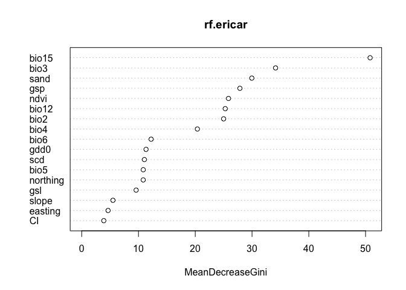

# Données

<!-- ## Données de présence de Erica Carnea -->
<!-- ```{r visudata, echo = FALSE, fig = TRUE} -->
<!-- library(leaflet)  -->
<!-- library(leafem) -->
<!-- library(stars) -->
<!-- sites_all = read.csv("_data_prod/sites_all.csv") -->
<!-- rasalti = raster('_data_prod/DEM90_sa.tif') -->
<!-- staralti= read_stars("_data_prod/DEM90_sa.tif", proxy = FALSE,  package="stars") -->

<!-- rasaltiwm = raster('_data_prod/DEM90_sa_wo_merc.tif') -->
<!-- staraltiwm= read_stars("_data_prod/DEM90_sa_wo_merc.tif", proxy = FALSE,  package="stars") -->

<!-- leaflet(sites_all)%>% -->
<!--   addProviderTiles("OpenStreetMap.HOT")%>% -->
<!--   leafem::addGeoRaster(staralti, opacity = 0.6, colorOptions = colorOptions(palette = "Blues")) %>% -->
<!--   setView(lng=5.5,lat=45,zoom=6) %>% -->
<!--   leafem::addGeoRaster(staraltiwm, opacity = 0.6, colorOptions = colorOptions(palette = "Reds")) %>% -->
<!--   setView(lng=5.5,lat=45,zoom=6) %>% -->
<!--   addCircleMarkers(lng = ~lon_wgs84, lat = ~lat_wgs84, popup = ~date, radius = 0.3, opacity = 0.8, color = "black")  -->


<!-- ``` -->


## Variables explicatives pour le modèle de distribution

```r
rf = readRDS("rfmod__all.rds")
rf.ericar = rf$rfmod
library(randomForest)
```

```
## randomForest 4.7-1.1
```

```
## Type rfNews() to see new features/changes/bug fixes.
```

```
## 
## Attaching package: 'randomForest'
```

```
## The following object is masked from 'package:ggplot2':
## 
##     margin
```

```
## The following object is masked from 'package:dplyr':
## 
##     combine
```

```r
varImpPlot(rf.ericar)
```

<!-- -->

## Prediction / projection


```r
library(leaflet)
library(leafem)
library(stars)
library(sf)
library(raster)

sites_all = read.csv("_data_prod/sites_all.csv")

# rf.predict.ericar.p= read_stars("_data_prod/rf.predict.ericar_prob_wm30_wm.tif", proxy = FALSE,  package="stars")
rf.values.p = raster("_data_prod/rf.predict.ericar_prob_wm30_wm.tif")
rasproj2 = raster::aggregate(rf.values.p, fac = 3)
rasproj2[rasproj2<0.01] = NA
rasproj2[rasproj2>1] = 1
rf.predict.ericar.p3 = st_as_stars(rasproj2)

leaflet(sites_all)%>%
  addProviderTiles("OpenStreetMap.HOT")%>%
  leafem::addGeoRaster(rf.predict.ericar.p3, opacity = 0.8, colorOptions = colorOptions(palette = colorRampPalette(c("lightblue", "violet", "darkviolet"), space="Lab"))) %>%
  setView(lng=5.5,lat=45,zoom=6) %>%
  addCircleMarkers(lng = ~lon_wgs84, lat = ~lat_wgs84, popup = ~date, radius = 0.3, opacity = 0.8, color = "black") 
```

```{=html}
<div id="htmlwidget-26c93b611d638916ca70" style="width:672px;height:480px;" class="leaflet html-widget"></div>
<script type="application/json" data-for="htmlwidget-26c93b611d638916ca70">{"x":{"options":{"crs":{"crsClass":"L.CRS.EPSG3857","code":null,"proj4def":null,"projectedBounds":null,"options":{}}},"calls":[{"method":"addProviderTiles","args":["OpenStreetMap.HOT",null,null,{"errorTileUrl":"","noWrap":false,"detectRetina":false}]},{"method":"addGeotiff","args":[null,"file2fb279324d54","file2fb279324d54",96,0,null,0.8,{"minZoom":0,"maxZoom":18,"tileSize":256,"subdomains":"abc","errorTileUrl":"","tms":false,"noWrap":false,"zoomOffset":0,"zoomReverse":false,"opacity":1,"zIndex":1,"detectRetina":false},{"palette":["#ACD8E5","#ADD7E6","#AED6E6","#AFD6E6","#AFD5E6","#B0D5E6","#B1D4E6","#B1D3E6","#B2D3E6","#B3D2E6","#B3D2E6","#B4D1E6","#B5D0E6","#B5D0E6","#B6CFE6","#B7CFE7","#B7CEE7","#B8CEE7","#B9CDE7","#B9CCE7","#BACCE7","#BBCBE7","#BBCBE7","#BCCAE7","#BCC9E7","#BDC9E7","#BEC8E7","#BEC7E7","#BFC7E7","#BFC6E8","#C0C6E8","#C1C5E8","#C1C4E8","#C2C4E8","#C2C3E8","#C3C3E8","#C3C2E8","#C4C1E8","#C5C1E8","#C5C0E8","#C6BFE8","#C6BFE8","#C7BEE8","#C7BEE8","#C8BDE9","#C8BCE9","#C9BCE9","#CABBE9","#CABAE9","#CBBAE9","#CBB9E9","#CCB9E9","#CCB8E9","#CDB7E9","#CDB7E9","#CEB6E9","#CEB5E9","#CFB5E9","#CFB4E9","#D0B3E9","#D0B3EA","#D1B2EA","#D1B1EA","#D2B1EA","#D2B0EA","#D3AFEA","#D3AFEA","#D4AEEA","#D4AEEA","#D5ADEA","#D5ACEA","#D6ACEA","#D6ABEA","#D7AAEA","#D7A9EA","#D8A9EA","#D8A8EB","#D9A7EB","#D9A7EB","#D9A6EB","#DAA5EB","#DAA5EB","#DBA4EB","#DBA3EB","#DCA3EB","#DCA2EB","#DDA1EB","#DDA1EB","#DEA0EB","#DE9FEB","#DE9EEB","#DF9EEB","#DF9DEB","#E09CEC","#E09CEC","#E19BEC","#E19AEC","#E199EC","#E299EC","#E298EC","#E397EC","#E396EC","#E396EC","#E495EC","#E494EC","#E593EC","#E593EC","#E692EC","#E691EC","#E690EC","#E790ED","#E78FED","#E88EED","#E88DED","#E88CED","#E98CED","#E98BED","#EA8AED","#EA89ED","#EA88ED","#EB88ED","#EB87ED","#EB86ED","#EC85ED","#EC84ED","#ED84ED","#ED83ED","#ED82ED","#ED81ED","#EC80ED","#EC80ED","#EB7FED","#EA7EED","#EA7DEC","#E97CEC","#E87CEC","#E87BEC","#E77AEC","#E679EB","#E679EB","#E578EB","#E477EB","#E476EB","#E375EA","#E275EA","#E274EA","#E173EA","#E072EA","#E072E9","#DF71E9","#DE70E9","#DE6FE9","#DD6EE9","#DC6EE8","#DC6DE8","#DB6CE8","#DA6BE8","#DA6AE7","#D96AE7","#D869E7","#D868E7","#D767E7","#D666E6","#D666E6","#D565E6","#D464E6","#D463E6","#D362E5","#D262E5","#D161E5","#D160E5","#D05FE5","#CF5EE4","#CF5EE4","#CE5DE4","#CD5CE4","#CD5BE4","#CC5AE3","#CB5AE3","#CB59E3","#CA58E3","#C957E2","#C956E2","#C855E2","#C755E2","#C654E2","#C653E1","#C552E1","#C451E1","#C450E1","#C350E1","#C24FE0","#C24EE0","#C14DE0","#C04CE0","#BF4BE0","#BF4BDF","#BE4ADF","#BD49DF","#BD48DF","#BC47DE","#BB46DE","#BA45DE","#BA44DE","#B944DE","#B843DD","#B842DD","#B741DD","#B640DD","#B63FDD","#B53EDC","#B43DDC","#B33CDC","#B33BDC","#B23ADB","#B139DB","#B139DB","#B038DB","#AF37DB","#AE36DA","#AE35DA","#AD34DA","#AC33DA","#AB32DA","#AB31D9","#AA30D9","#A92FD9","#A92ED9","#A82CD8","#A72BD8","#A62AD8","#A629D8","#A528D8","#A427D7","#A326D7","#A324D7","#A223D7","#A122D6","#A021D6","#A01FD6","#9F1ED6","#9E1DD6","#9D1BD5","#9D1AD5","#9C18D5","#9B17D5","#9A15D4","#9A13D4","#9911D4","#980FD4","#970DD4","#970AD3","#9608D3","#9505D3","#9402D3","#9300D2"],"breaks":null,"domain":null,"na.color":"#bebebe22"},false,null,true]},{"method":"addCircleMarkers","args":[[44.0814496801746,44.085289329173,44.1210622118885,44.0896045211887,45.4234171999997,45.26626,45.26379,45.2643893382255,45.2698702956729,45.26626,45.2648,45.7291589999976,45.2633703406731,45.2534151999977,45.2365791984627,45.23655219714,45.2365971971546,45.2368581979979,45.23655219714,45.2651523368351,45.2079777285099,45.4297282999994,45.2676973083571,45.4380484985328,45.2648,45.2310173834832,45.2383521655198,45.2365971971546,45.2383521655198,45.7294353000012,45.26243,45.26243,45.26379,45.26071,45.2006878641548,45.4286706807219,45.2658543230065,45.4279863000023,45.430086899999,45.2084997999996,45.2479370231509,45.2692672954647,45.4288818999976,45.2645713999982,45.2658033244696,45.4387251000042,45.4394142999963,45.2653414000002,45.2648,45.26243,45.2662623259276,45.26677,45.2073150000032,45.2361742063776,45.2517463000004,45.2647273371596,45.2556223723998,45.2736922809484,45.2670773162108,45.2681573059146,45.2656013256408,45.2694642959657,45.2721182830703,45.4388225029698,45.2695102954641,45.2681123081106,45.26071,45.2365791984627,45.2098097000009,45.2634843403384,45.2379921663321,45.2379921663321,45.2368581979979,45.4270737000045,45.2561573641287,45.2178215000034,45.26071,45.2565,45.2565,45.2604,45.2604,45.27,45.27,45.2455,45.2455,45.2442,45.2442,45.2651,45.2651,45.2468,45.2468,45.2303,45.2303,45.2789,45.2789,45.2721,45.2721,45.2642,45.2642,45.2632,45.2632,45.2613,45.2613,45.2653,45.2653,45.2438,45.2438,45.2777,45.2777,45.258,45.258,45.2199,45.2199,45.2199,45.2199,45.2059,45.2059,45.2079,45.2079,45.4391,45.4391,45.4386,45.4386,45.4375,45.4375,45.4353,45.4353,45.4338,45.4338,45.2184167,45.21842,45.2197778,45.21978,45.2187778,45.21878,45.2159167,45.21592,46.0473,46.0473,45.23665,45.23665,45.23293647,45.23268847,45.23246712,45.23223547,45.23194921,45.23165755,45.23103943,45.23037372,45.23803323,45.23621412,45.23572452,45.23566366,45.21861908,45.21652781,45.22094166,45.21735105,45.21447922,45.20764026,45.20891958,45.21343842,45.20997624,45.21045579,45.21145881,45.230454,45.23083,45.252175,45.251894,45.11418659,45.1163597,45.11468302,45.11495936,45.11630853,45.1172446,45.11367378,45.11724782,45.11762953],[7.54927368871032,7.53169560166486,7.53582528141145,7.5359045875796,6.6686450999999,6.77682,6.78542,6.77661742685957,6.78723246967735,6.77682,6.78125,6.34616959999964,6.77585441850393,6.75547139999945,6.76476260405347,6.76475359740301,6.76472660220451,6.76478959857935,6.76475359740301,6.77721343399581,6.72357701336132,6.66137899999941,6.78541244856874,6.66036793558946,6.78125,6.7900985682244,6.76572563325596,6.76472660220451,6.76572563325596,6.34449019999984,6.79133,6.79133,6.78542,6.79578,6.7118135456106,6.6596659104886,6.78341143265864,6.66885270000065,6.67146249999963,6.72591400000021,6.78703844052382,6.78641846083007,6.65970189999957,6.7672195000005,6.77621344541222,6.67275120000011,6.67239059999977,6.7665755000001,6.78125,6.79133,6.77637843987617,6.76935,6.7369090000009,6.76342154460767,6.75660060000059,6.77673543769744,6.78733333827161,6.77965750711965,6.7770074516631,6.7856754455529,6.77667643192712,6.78658145940593,6.7893434885558,6.66742418464955,6.78672145510899,6.77770945870602,6.79578,6.76476260405347,6.72439590000032,6.77625742501171,6.76523061883925,6.76523061883925,6.76478959857935,6.66787800000032,6.78793534670385,6.79660690000053,6.79578,6.78825,6.78825,6.78562,6.78562,6.79169,6.79169,6.80164,6.80164,6.79997,6.79997,6.78787,6.78787,6.76832,6.76832,6.7895,6.7895,6.82897,6.82897,6.83815,6.83815,6.77736,6.77736,6.77616,6.77616,6.77386,6.77386,6.78201,6.78201,6.73172,6.73172,6.83467,6.83467,6.79132,6.79132,6.81229,6.81229,6.8177,6.8177,6.69735,6.69735,6.72241,6.72241,6.67168,6.67168,6.67256,6.67256,6.67335,6.67335,6.672,6.672,6.66924,6.66924,6.79911111111111,6.799111,6.79805555555556,6.798056,6.79530555555556,6.795306,6.79541666666667,6.795417,6.387505,6.387505,6.76468,6.76468,7.451179781,7.452141988,7.453077985,7.455249984,7.456047585,7.457112851,7.457333407,7.457364159,7.461972887,7.463920288,7.46432843,7.465158186,7.417345779,7.417785885,7.418007335,7.418081453,7.418708723,7.419522234,7.419601405,7.419603574,7.419852295,7.420030032,7.420307891,7.441304,7.441316,7.446619,7.446669,7.067706378,7.0740137,7.070148697,7.070520781,7.075789607,7.076851528,7.077022359,7.077042128,7.077258154],0.3,null,null,{"interactive":true,"className":"","stroke":true,"color":"black","weight":5,"opacity":0.8,"fill":true,"fillColor":"black","fillOpacity":0.2},null,null,["2007-06-08","2007-06-07","2007-06-26","2007-06-26","2018-07-05","2017-06-26","2017-06-26","2018-07-08","2018-07-08","2017-06-26","2017-06-26","2018-08-31","2018-07-08","2016-08-01","2007-07-01","2007-07-01","2009-07-01","2009-07-01","2009-07-01","2018-07-08","2008-06-18","2018-07-05","2018-07-08","2006-05-29","2017-06-26","1971-05-26","2007-07-01","2007-07-01","2009-07-01","2018-08-31","2017-06-26","2017-06-26","2017-06-26","2017-07-27","2007-08-02","2006-05-29","2018-07-08","2018-07-05","2018-07-05","2017-05-12","1971-05-26","2018-07-08","2018-07-05","2016-08-01","2018-07-08","2018-07-06","2018-07-06","2016-08-01","2017-06-26","2017-06-26","2018-07-08","2017-06-27","2017-05-12","2006-09-27","2016-08-01","2018-07-08","2018-07-08","2018-07-08","2018-07-08","2018-07-08","2018-07-08","2018-07-08","2018-07-08","1971-05-24","2018-07-08","2018-07-08","2017-07-27","2009-07-01","2017-05-12","2018-07-08","2009-07-01","2007-07-01","2007-07-01","2018-07-05","2018-07-08","2018-06-25","2017-07-27","03_06_2022","2022-06-03","03_06_2022","2022-06-03","03_06_2022","2022-06-03","03_06_2022","2022-06-03","03_06_2022","2022-06-03","13_06_2022","2022-06-13","13_06_2022","2022-06-13","14_06_2022","2022-06-14","15_06_2022","2022-06-15","15_06_2022","2022-06-15","16_06_2022","2022-06-16","16_06_2022","2022-06-16","16_06_2022","2022-06-16","16_06_2022","2022-06-16","14_06_2022","2022-06-14","15_06_2022","2022-06-15","15_06_2022","2022-06-15","17_06_2022","2022-06-17","17_06_2022","2022-06-17","17_06_2022","2022-06-17","17_06_2022","2022-06-17","20_06_2022","2022-06-20","20_06_2022","2022-06-20","20_06_2022","2022-06-20","20_06_2022","2022-06-20","20_06_2022","2022-06-20","2022-06-21","21_06_2022","2022-06-21","21_06_2022","2022-06-21","21_06_2022","2022-06-21","21_06_2022","2022-06-22","22_06_2022","2022-06-24","24_06_2022","07_06_2022","07_06_2022","07_06_2022","07_06_2022","07_06_2022","07_06_2022","07_06_2022","07_06_2022","07_06_2022","07_06_2022","07_06_2022","07_06_2022","08_06_2022","08_06_2022","08_06_2022","08_06_2022","08_06_2022","08_06_2022","08_06_2022","08_06_2022","08_06_2022","08_06_2022","08_06_2022","09_06_2021","09_06_2021","09_06_2021","09_06_2021","13_05_2022","13_05_2022","25_05_2022","25_05_2022","25_05_2022","25_05_2022","25_05_2022","25_05_2022","25_05_2022"],null,null,{"interactive":false,"permanent":false,"direction":"auto","opacity":1,"offset":[0,0],"textsize":"10px","textOnly":false,"className":"","sticky":true},null]}],"setView":[[45,5.5],6,[]],"limits":{"lat":[44.0814496801746,46.0473],"lng":[6.34449019999984,7.54927368871032]}},"evals":[],"jsHooks":[]}</script>
```
