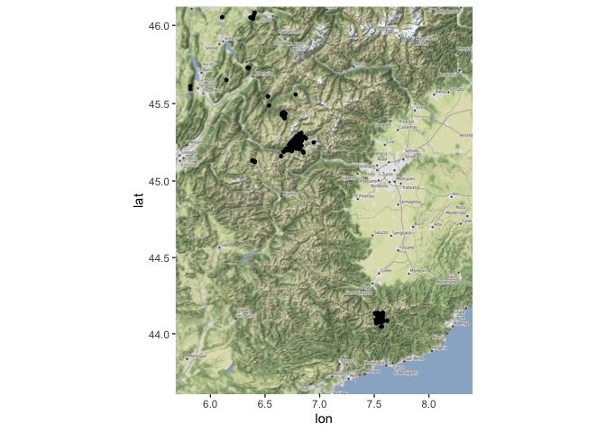
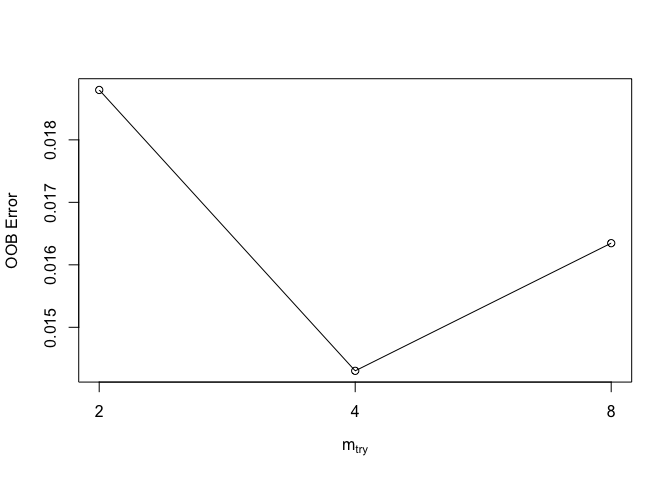
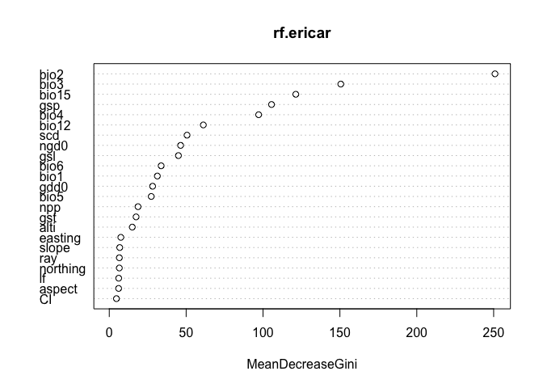
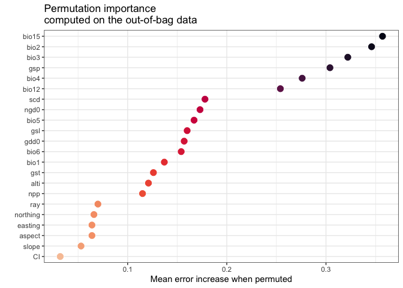
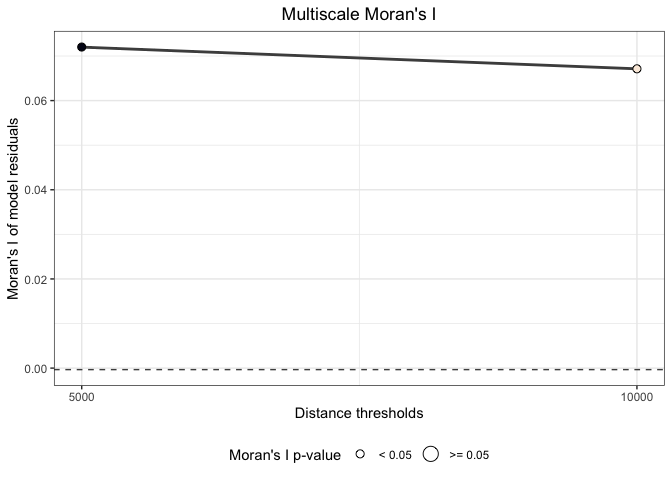

## Chargement des données

```r
pts = read.table("_data/export_478_24032021_151335.txt", sep='\t', h=TRUE)
sites_points = pts %>% dplyr::select(id_releve, date_releve_deb, lon_wgs84, lat_wgs84, x_l93, y_l93, id_precision)

sites_points1 = sites_points %>% filter(!is.na(lon_wgs84))
coordinates(sites_points1)= c("lon_wgs84","lat_wgs84")
proj4string(sites_points1) = CRS("+proj=longlat +ellps=WGS84 +datum=WGS84 +no_defs")
#sites_points1 = spTransform(sites_points1, CRS("+init=epsg:4326"))

sites_df <- data.frame(sites_points1)
require(tmaptools)
```

```
## Le chargement a nécessité le package : tmaptools
```

```r
bbox <- tmaptools::bb(xlim = c(5.68,  8.40), ylim = c(43.60, 46.12))
```


## Répartition des observations

```r
bbox_map <- c(left = 5.68,  right = 8.40, bottom = 43.60, top= 46.12)
p <- ggmap(get_map(bbox_map, source = 'osm',
                         maptype ='terrain',
                         color = 'color'))
```

```
## Source : http://tile.stamen.com/terrain/9/264/181.png
```

```
## Source : http://tile.stamen.com/terrain/9/265/181.png
```

```
## Source : http://tile.stamen.com/terrain/9/266/181.png
```

```
## Source : http://tile.stamen.com/terrain/9/267/181.png
```

```
## Source : http://tile.stamen.com/terrain/9/264/182.png
```

```
## Source : http://tile.stamen.com/terrain/9/265/182.png
```

```
## Source : http://tile.stamen.com/terrain/9/266/182.png
```

```
## Source : http://tile.stamen.com/terrain/9/267/182.png
```

```
## Source : http://tile.stamen.com/terrain/9/264/183.png
```

```
## Source : http://tile.stamen.com/terrain/9/265/183.png
```

```
## Source : http://tile.stamen.com/terrain/9/266/183.png
```

```
## Source : http://tile.stamen.com/terrain/9/267/183.png
```

```
## Source : http://tile.stamen.com/terrain/9/264/184.png
```

```
## Source : http://tile.stamen.com/terrain/9/265/184.png
```

```
## Source : http://tile.stamen.com/terrain/9/266/184.png
```

```
## Source : http://tile.stamen.com/terrain/9/267/184.png
```

```
## Source : http://tile.stamen.com/terrain/9/264/185.png
```

```
## Source : http://tile.stamen.com/terrain/9/265/185.png
```

```
## Source : http://tile.stamen.com/terrain/9/266/185.png
```

```
## Source : http://tile.stamen.com/terrain/9/267/185.png
```

```
## Source : http://tile.stamen.com/terrain/9/264/186.png
```

```
## Source : http://tile.stamen.com/terrain/9/265/186.png
```

```
## Source : http://tile.stamen.com/terrain/9/266/186.png
```

```
## Source : http://tile.stamen.com/terrain/9/267/186.png
```

```r
p + geom_point(data=sites_df,  aes(x=lon_wgs84, y=lat_wgs84), size=1) 
```

```
## Warning: Removed 1 rows containing missing values (geom_point).
```

<!-- -->

```r
library(leaflet) 
leaflet(sites_df)%>%
  addProviderTiles("OpenStreetMap.HOT")%>%
  setView(lng=5.5,lat=45,zoom=6) %>%
  addCircleMarkers(lng = ~lon_wgs84, lat = ~lat_wgs84, popup = ~date_releve_deb, radius = 1, opacity = 0.8, color = "red")
```

```{=html}
<div id="htmlwidget-fdd63852ffed863ea242" style="width:672px;height:480px;" class="leaflet html-widget"></div>
<script type="application/json" data-for="htmlwidget-fdd63852ffed863ea242">{"x":{"options":{"crs":{"crsClass":"L.CRS.EPSG3857","code":null,"proj4def":null,"projectedBounds":null,"options":{}}},"calls":[{"method":"addProviderTiles","args":["OpenStreetMap.HOT",null,null,{"errorTileUrl":"","noWrap":false,"detectRetina":false}]},{"method":"addCircleMarkers","args":[[44.0869100300033,44.1225989265044,44.0944605178651,44.0888805485844,44.1286976600799,44.1290905717764,44.0889249597149,44.0827896541259,44.127514049586,44.111419683325,44.0872433642307,44.0905551832433,44.0905551832433,44.0866692853774,44.0905551832433,44.0846658255709,44.0866147828932,44.0946732019754,44.1259233265398,44.0830540868005,44.0898759723891,44.1257679933625,44.0889488173079,44.0877133657037,44.0923682299897,44.1290905717764,44.1284266616756,44.1339743962215,44.1284349082303,44.0944605178651,44.133138813906,44.0862380288347,44.0906368794694,44.0698153356298,44.0868142934509,44.0905551832433,44.0889249597149,44.0864173814457,44.0905551832433,44.0945935976385,44.0905551832433,44.1291372863175,44.047871848836,44.0804546276614,44.0889249597149,44.0697498629561,44.137539793162,44.0867334237764,44.0867234054648,44.0905551832433,44.0932695264135,44.0881087965154,44.0841938772403,44.0876530528815,44.0915958332924,44.1271978981304,44.1290905717764,44.1021483579564,44.0814417312845,44.1055004356385,44.0845286662249,44.1028029685089,44.110494971414,44.0813659886334,44.0852713581323,44.0861663621967,44.0999633865516,44.1185210319353,44.1217651283555,44.085289329173,44.1117365202718,44.1210622118885,44.0896045211887,44.0874,44.0899,44.0867,44.0882,44.1320601008046,44.1352207018813,44.0823801929228,44.1238132815944,44.1197779078729,44.0861489510161,44.0826374804649,44.1217992268186,44.0981110733781,44.1111449878619,44.1402887480872,44.1222445020418,44.0807,44.135120112981,44.0852974924752,44.0778722346175,44.0869158063791,44.1274615322893,44.048052944845,44.1225569291135,44.1191412280611,44.0901,44.0810383632333,44.0874403350583,44.0822915863789,44.090845888736,44.0814496801746,44.1288969016428,45.4234171999997,45.4385705025534,45.4364915381133,45.4341696024085,45.2643893382255,45.2698702956729,45.4371395247166,45.4360235380536,45.4384445061794,45.4409014744614,45.2633703406731,45.2534151999977,45.2103629064702,45.2651523368351,45.2676973083571,45.2310173834832,45.2658543230065,45.4279863000023,45.430086899999,45.2084997999996,45.2692672954647,45.4288818999976,45.2645713999982,45.2658033244696,45.4387251000042,45.4394142999963,45.2653414000002,45.2662623259276,45.2647273371596,45.2556223723998,45.2736922809484,45.2670773162108,45.2681573059146,45.2656013256408,45.2694642959657,45.2721182830703,45.4388225029698,45.2695102954641,45.2681123081106,45.2634843403384,45.4270737000045,45.2561573641287,45.2178215000034,45.4277347251039,45.2677367404677,45.2704365418461,46.0788485180296,45.218237629607,45.240737183038,45.2305793714334,45.2013614469139,45.2812363072084,45.2542367785972,45.2260431726633,45.4342325795942,45.4234327806702,45.2069877490241,45.2879861953139,45.2382881459232,45.4286706807219,45.2092377460522,45.2542370304699,45.2305579979909,45.2452370823006,45.2508604391969,45.2605361633989,45.2434371046105,45.2304863445183,45.2272373282249,45.2632366839583,45.2576161529824,45.2064358651907,45.2418639089382,45.2048098111743,45.4234328001924,45.2974025306478,45.4340258007755,45.4342326007525,45.2272373860464,45.2389370703851,45.132934999417,45.126785000892,45.2069877865722,45.4379379562058,45.2524368143146,45.2350767406336,45.4252327589532,45.254236853383,45.2609867227052,45.2024877994459,45.2609868432727,45.2614367175641,45.2384871605176,45.2013635760639,45.2036128202257,45.2812365964951,45.430931737734,45.2024878199734,45.2137378372498,45.2519869388292,45.2485021256643,45.2705759797551,45.2365791984627,45.2767364267082,45.2632366120232,45.24411552587,45.2898588299798,45.2458433804685,45.263236840579,45.2013651218546,45.4229828138142,45.2481315860045,45.2542369087816,45.246361981968,45.4401925590011,45.2344372025573,45.2013660806814,45.4329616851497,45.286858125896,45.2024877876721,45.2834865529862,45.2632366206577,45.2365971971546,45.2092376739932,45.4359214065387,45.4355640818502,45.2067986597121,45.2396121288901,45.2069877652851,45.266570184364,45.254236766771,45.2351135688445,45.4403439167263,45.2452370532808,45.2318273811828,45.2260429454307,45.243437074769,45.2450751236701,45.4390070160764,45.274936497614,45.2384872040454,45.2542370447011,45.2074377411637,45.2722366821802,45.2092379110822,45.2371838130513,45.2609333242358,45.279436387846,45.2006878641548,45.2497369186314,45.2497369849699,45.2407370933425,45.2047377282306,45.2519868866545,45.2418642046259,45.2407371416429,45.2868628206877,45.2164376626374,45.2728219941122,45.2317374466049,45.2441121519102,45.2185256866315,46.0608484855626,45.2839365138432,45.2261339634536,45.2344372339527,45.439028001005,45.2486157690503,45.2164377129592,45.4325639781052,45.2262017710721,45.1991129098112,45.2494622326236,45.2073150000032,45.2812366033352,45.2780416874827,45.2058667734591,45.2452371845323,45.2159876519099,45.5467304687026,45.4372212912991,45.2103626821992,45.4396053778506,45.2744866731555,45.2272374536612,45.204737822207,45.2549968947672,46.0469979276306,45.2350693886018,45.2587367634756,45.2767363805884,45.2362372086196,45.2283175775247,45.2047377357823,45.2429869937582,45.2071947162896,45.2126126145348,45.7294353000012,45.2677366044169,45.265936681494,45.2047378071136,45.4409824547286,45.2794364266633,45.2497369692645,45.2200277379503,45.2474869027901,45.258736890506,45.2317373015876,45.6513524148711,45.2654867900155,45.2463620059208,45.2285609705937,46.3978781053166,45.4331391986802,45.2067782324106,45.2418664907229,45.2452370297869,45.2418618648044,45.4252327917444,45.2789175033432,45.2463619733778,45.2351082158736,45.4229828138142,45.2227374586839,45.2114876502523,45.2839362741873,45.4201824469207,45.2373639674264,45.3109359258208,45.2452371389322,45.2479371268506,45.4380484985328,45.2839365387847,45.4355513252558,45.1836987205402,45.2047377261026,45.2165262154154,45.2081114175538,45.2569367217625,45.2360267402262,45.2396105445571,45.2272373745353,45.2429870168347,45.2377131053027,45.2069877389816,45.2294874214433,45.2659367908252,45.2218710032004,45.4287772966432,45.2396151056385,45.2305826647618,45.2733629283975,45.2283059117456,45.2384871274051,45.4297282999994,45.2074377816938,45.126785000892,45.2204877216825,45.2621065525562,45.2407371104666,45.2092377048759,45.2497370865221,45.4319826187258,45.2441106025449,45.2767363984696,45.2339871968315,45.4322818444171,45.2744864787366,45.2283623489172,45.25198682909,45.2677367766117,45.27223644986,45.2524368687818,45.2029377594488,45.2164376922875,45.2497370242451,45.2024877753121,45.2632366136552,45.4316441783054,45.2047377816209,45.2542369510852,45.285736246217,45.2474869304874,45.2457018096515,45.2362372004083,45.281236314584,45.2182376803015,45.2767366284112,45.2344371350389,45.2182377475746,45.2496219595771,45.2339873485083,45.2767364131871,45.274936634474,45.2262958274114,45.430510533781,45.2699867172925,45.2362372004083,45.2344372747862,45.2077912327571,45.2724477831829,45.2396818560502,45.2825449497586,45.2614367596236,45.2036172162558,45.2137377609811,45.2272014682798,45.2182377247009,45.2776133745567,45.2632368252525,45.2351082158736,45.2047377824929,45.2441139492635,45.2047377615491,45.2497368575945,45.2227374238791,45.2543500896097,45.2569368337908,45.2137377913096,45.2227376712754,45.1939380786967,45.2463619902756,45.2013590868999,45.2159876661149,45.256486732264,45.2373602353056,45.2013606296444,45.2531141044962,45.7299583999979,45.255358776709,45.2429870763538,45.2632368566291,45.2396121367506,45.2362227233135,45.2339872459395,45.2659366719672,45.2407370482254,45.2389370590928,45.4322880913981,45.2524930096405,45.2058671930225,45.2362372433759,45.2092377447387,45.4252327731647,45.2195953775152,45.2463581003363,45.2497369821477,45.2176352084758,45.2164375958125,45.2373614467465,45.437553480397,45.2206663118946,45.2047378281855,45.2299759393728,45.2519870517173,45.2362371554352,45.2060771875584,45.2204875889336,45.2362371297577,45.2677367687205,45.2564868621988,45.2531107095642,45.4359138362122,45.2254374863933,45.4398072905238,45.2353371127471,45.2159877302775,45.4332622630286,45.2587369162422,45.2465102284962,45.2542370265108,45.2047378318862,45.2632368503583,45.4307552723046,45.2441120349106,45.2344373367878,45.2497369014857,45.2084002999985,45.2362372850854,45.2452370167605,45.2058627638233,45.2609868638454,45.2812365432116,45.7291589999976,45.4279327151452,45.2137378271893,45.4319826518794,45.2188829841643,45.2524370685549,45.2479369247235,45.2789863669046,45.2249876628149,45.2384870655682,45.4409824654734,45.2263417062354,45.4270728000013,45.2182376903883,45.4871064568595,45.2519869568294,45.2283623610964,45.242987069625,45.2587367790583,45.2441146317569,45.2396485812113,45.4297326600844,45.2272374752775,45.2722366979922,45.2396151056385,45.23736059449,45.2434371819271,45.2614366888816,45.438397298992,45.2362371320306,45.2361742063776,45.2452370421825,45.265486812167,45.2339872646289,45.2542368442871,45.2812365324844,45.2092378837281,45.2058661331629,45.2429870534569,45.2058627221649,45.2479370472215,45.2047378179366,45.251987064651,45.2519868597769,45.2196041431492,45.2339872738497,45.2429870449794,45.24748706021,45.2744866456932,45.237359172026,45.2497370697575,45.2452369827484,45.2794365609642,45.4340040358989,46.0788485180296,45.4401933584433,45.2479369590014,45.25988871156,45.213737773107,45.2744864178619,45.2418655514886,45.4399968326276,45.272236486599,45.2722365067911,45.2373304097629,45.2452370031496,45.4332606608343,45.2418605750308,45.2047377871747,45.2479368891389,45.2633563413722,45.2479370253924,45.245647147526,45.202937811787,45.2474870321498,45.4324326246055,45.2767363744244,45.2182377662869,46.051846174748,45.265486637507,45.2524370071856,45.2362371646208,45.256486799764,45.2609867622584,45.2528263134625,45.2497369941788,45.2497370708738,45.2617977137385,45.2744864365949,45.2126126268388,45.2249874905613,45.2812364196738,45.4328610672948,45.2474869172823,45.2564868143699,45.2029377736423,45.2542368349748,45.4333670712799,45.2227376837988,45.2282878725567,45.2155439983273,45.218237736467,45.240737158151,45.22273754392,45.2604349915275,45.2318273928553,45.2182376350304,45.2452370032533,45.2103626736408,45.4395451537966,45.2272376009795,45.2374619252246,45.2365791984627,45.202937811787,45.236237191957,45.2677365877443,45.132934999417,45.2441085761293,45.2047377464731,45.2159572416669,45.4387324957818,45.4364825297225,45.2868580273497,45.2632368147274,45.254236834366,45.2074377162134,45.2452370295043,45.2013668465167,45.2204876202903,45.296986120443,45.2094994676918,45.2351122216831,45.256486911549,45.266108000673,45.2418629404153,45.2067612050628,45.2704365920347,45.2029377868299,45.2362372086196,45.2587367980471,45.2587368662042,45.2024878364746,45.2434369873639,45.2569368194782,45.2609868836032,45.4374693904025,45.4061081783,45.2364404902933,45.2704367430822,45.2441120834981,45.2407370540674,45.4381294734108,45.2407370390699,45.2569367620689,45.25650480901,45.2058627821529,45.2463634532525,45.2036146661214,45.2182376154433,45.2182376198013,45.4395939751892,45.2654867670634,45.2834862750391,45.2474869837009,45.2474870258242,45.2396086322644,45.2632367302237,45.1939380786967,45.4349240531696,45.26626,45.2092377043589,45.2524286373846,45.4241077973083,45.2299374040001,45.2171127046453,45.2284521250497,45.2654865786516,45.2429869671835,45.429732688426,45.218946005149,45.2452369474866,45.2227374627647,45.2564868281453,45.2749364466366,45.2542368782613,45.2441102183847,45.2074379536269,45.2527069345391,45.2722367125701,45.2452369665355,45.2203310645374,45.2294873483305,45.2373641249677,45.2396128308455,45.4340115653941,45.4307756871983,45.2794363673042,45.2557713364846,45.2299373316399,45.2013615777381,45.2362371020314,45.2434370114407,45.2587367513328,45.2119376652544,45.2452370907972,45.275611843744,45.4394698736383,45.2587367304158,45.274486445562,45.2524370313379,45.4279327508705,45.2384870858607,45.4404041399259,45.2236017458914,45.2198650392007,45.2362372239564,45.2373655303867,45.4252327440417,45.2344372211064,45.2587367561682,45.4414324518354,45.2632366544927,45.2479370617783,45.2137377719166,45.4394548175963,45.2744864627514,45.2362372227823,45.2839363343783,45.2812362967782,45.2524367860876,45.2659366074418,45.2632368078972,45.2569368477062,45.2458433804685,45.2488163548517,45.4332352857364,45.4383808990395,45.2339873325211,45.2569368043363,45.2407371652145,45.23655219714,45.2384870759461,45.2002378846429,45.2373582325836,45.2328599120428,45.2812363488268,45.4342325906282,45.218237736467,45.2812363249729,45.2677366091166,45.2418603815652,45.254236792712,45.4359356607413,45.4305174650982,45.2452370639428,45.2294117480116,45.2648373842528,45.2389371724515,45.2119378931091,45.2550558687814,45.2351145084274,45.2062494463237,45.4355437506356,45.2564869293367,45.252436927737,45.2272373487351,45.2497368792691,45.2542369984895,45.2418126419572,45.2564867770548,45.4369325367053,45.2542369012853,45.2614368437143,45.2066351007548,45.2350152454729,45.2463619645298,45.3019360280569,45.4342325805739,45.2058623117083,45.2395579436257,45.2659366410882,45.2654866143944,45.2587367437037,45.2389370897838,45.2497368980357,45.2479369705704,45.2254373652951,45.2407370681833,45.2618056919838,45.248611917499,45.2699865250662,45.2084721438977,45.2982222086111,45.2992360854186,45.2373586162696,45.2273274619628,45.4402068153986,45.2384870538755,45.2886539071351,45.2214914823601,45.2648790784283,45.4330903540218,45.2362371050404,45.2227376781614,45.2632367970618,45.2812365246585,45.7288165779028,45.2182376597919,45.243437041447,45.729009799997,45.2834865298311,45.2536068878358,45.2092379075609,45.252436847733,45.2384872387092,45.241331032469,45.2749364173615,45.2036090925063,45.2609867770977,45.2496172200603,45.2659365791592,45.2407370757679,45.2407372068025,45.2192155741699,45.2767364188256,45.2632367424263,45.557981151403,45.2834865149278,45.2407371799591,45.249736955529,45.2047377440405,45.2047377998514,45.4397124274133,45.2272374620667,45.23848714233,45.2029378209525,45.4316498731147,45.2624143446522,45.2092377341079,45.2396122753309,45.2098097000009,45.2452371295477,45.2677365925028,45.2362371838207,45.2557577535125,45.7297367000013,45.2497370054807,45.229937426638,45.2418597714407,45.2651263321252,45.4393756240299,45.2447417140741,45.2716278395549,45.2452370169539,45.2204876705339,45.2614367353961,45.1892040152333,45.2182376296714,45.2434372001686,45.2722364746214,45.2396106342504,45.2564867933217,45.2553553818132,45.2362371189838,45.2479370844715,45.2722365358432,45.433828048683,45.2115286239877,45.4316366570372,46.0472121981906,45.2317372973641,45.2614368851565,45.202487761524,45.2632367222734,45.2362372984415,45.2699867423029,45.4319826328968,45.2587366851825,45.2307180983842,45.2524368954497,45.2845752623618,45.26998678953,45.2479369049994,45.228333984577,45.2317373797481,45.2384872546255,45.2497368736306,45.2497368690718,45.2654866848017,45.2587368035279,45.2632366691199,45.2722365266074,45.2868628127343,45.429732651488,45.249737016578,45.43198263823,45.2389371075024,45.254236824723,45.435260820152,45.2587367383671,45.283486323589,45.2497370049249,45.2677368211412,45.1290359987601,45.2699865621745,45.2461459471974,45.2517463000004,45.1290359987601,45.4252327873227,45.2013629396386,45.2587368245611,45.2617913578144,45.2749364813922,45.2407371938217,45.4307405943007,45.2479369808513,45.2272373966318,45.428607704782,45.265486626567,45.2418597714407,45.2085177361021,45.2384871563655,45.2722365076792,45.2235195815915,45.2587367250074,45.2767364323003,45.267736654628,45.4402725672743,45.2396102487594,45.2058634921682,45.2119376070624,45.2609867309971,45.2677366249364,45.2197108433509,45.2524368825376,45.4381124918362,45.2542368136334,45.2613053570052,45.2463619733373,45.2677366644639,45.2542368038752,45.2148659739647,45.2066517354127,45.214839917647,45.2497368509321,45.4336295080705,45.272236675867,45.4342325683065,45.2474870819446,45.23655219714,45.4328410552763,45.4402949915174,45.2389371596961,45.2396118915072,45.4429444155807,45.2587368213724,45.2463587108158,45.237839417036,45.4382692573215,45.4402234701302,45.2429870057337,45.4274827334733,45.2722366595692,45.406599940954,45.4297326548457,45.240737196112,45.2423983773515,45.4352319053817,45.4331684443934,45.2036127277158,45.2767364450105,45.4396806578249,45.2479370322393,45.2659365636036,45.2825338874647,45.2789863864303,45.2081127151767,45.2441682739513,45.2632366539178,45.2542368619342,45.4297326774075,45.2519868448559,45.2362749035724,45.2283623489172,45.4381200173243,45.2452369891,45.2653093023609,45.2159876703638,45.2306122829119,45.2434371533858,45.2013628565681,45.2576157938215,45.2817436002845,45.2749364366655,45.2486140140391,45.2283623462505,45.2463612692321,45.2407371381837,45.2284233714933,45.2058604057141,45.4376651822988,45.27673660339,45.2992360958375,45.245874670942,45.2379921663321,45.4324326393628,45.6131023739546,45.2441161113289,45.2407371043848,45.2317373865888,45.20360976849,45.2839362888516,45.2074377751885,45.2383521655198,45.2262451596673,45.2452370032533,45.27043656995,45.2706170910526,45.2351135688445,45.213737783634,45.2452369494552,45.2339872349113,45.2947361636251,45.2625526738333,45.2524368314458,45.2407370809899,45.2002378256319,45.2407371462227,45.2110377629971,45.2114876502523,45.2812363249729,45.247936990704,45.2294874279759,45.2389370469127,45.2517348381515,45.2536596308668,45.2429871174152,45.2789863962045,45.2159877767863,45.2654866668398,45.2119378396222,45.2445392890243,45.2699865875743,45.4312246789301,45.276736439897,45.2887848594735,45.2036152184932,45.243436999839,45.4297326854674,45.2519868734236,45.4334592028153,45.2192125687358,45.2463619982599,45.2722364965337,45.2612160180471,45.2733490450239,45.260986821885,45.4387325043613,45.2182377641908,45.2474871428613,45.2654868335177,45.2182376616848,45.422785175354,45.2659380561329,45.2362372371218,45.2036098506424,45.2396086322644,45.2497370427132,45.2677368037698,45.2272376156723,45.2467790161986,45.2587367747954,45.1242660031272,45.202937801616,45.2389372152462,45.2272373890483,45.2137378436761,45.2384871935665,45.2304594057465,45.2511369428003,45.2744864943822,45.4357175891191,45.4252327536881,45.2479369110075,45.2182377158462,45.209237698876,45.2497369409411,45.2367947135286,45.2066784319942,45.2452371138786,45.2429871296411,45.250115709705,45.2722365447559,45.2204876318452,45.2589895440885,45.2047378370097,45.2294873317443,45.272236719339,45.2348026420195,45.2474869428323,45.24636588346,45.2497370965521,45.2191376564835,45.2749224204944,45.2794365374707,45.2542367803747,45.2463601938548,45.2542368150427,45.2067834953359,45.236327315759,45.2389371847494,45.4403130056527,45.2794363986384,45.2182326956181,45.2757260023831,45.3028989820224,45.2610970117527,45.2159877128512,45.228375254826,45.2400696406509,45.2632367187528,45.2503814101964,45.4274827017944,45.2064295532697,45.2362372298324,45.2362372165405,45.2644265041991,45.220937605789,45.2486081222349,45.4334839921591,45.2396161437949,45.2767364045864,45.4346058186481,45.239093526725,45.2789863341438,45.2396097072048,45.2204876514463,45.2514690792027,45.4274827444025,45.225276000004,45.2497368624939,45.2351139523317,45.2542369155806,45.2868580273497,45.2062906022414,45.2539550419332,45.2542369786248,45.235122092346,45.232862438182,45.4334690738951,45.2058612274065,45.228511940162,45.4297326803596,45.2497370353842,45.2663392854693,45.2810579983912,45.4341034558957,45.2519869101511,45.2299374155613,45.2587368072188,45.2434370504294,46.0436876038872,45.2362371923737,45.2260157549389,45.2215130000044,45.226515,45.4279326902371,45.2365971971546,45.2389370993007,45.2013644460945,45.247486973936,45.2812363635013,45.2036124917093,45.2249876267264,45.2497369453035,45.2394297522419,45.2283623635159,45.2092377043589,45.254236992669,45.7290521999964,45.4346133523285,45.2576101042884,45.2172848001674,45.2373658796369,45.2497369593784,45.2587368789635,45.2677366399623,45.2179873741782,45.4297326932594,45.235108826778,45.2452369650844,45.2524369075182,45.4304529188138,45.2272375894122,45.2569369399661,45.2368581979979,45.4252328051076,45.4398019050306,45.2407370882161,45.1290359987601,45.2542370117704,45.2058611085895,45.2497369065274,45.2564868410903,45.2452369882567,45.2789863556155,45.2407370997823,45.2654866570709,45.2407370624377,45.2524368049064,45.2199596007719,45.4279327276063,45.2137377447629,45.2569368603606,45.248587089247,45.2434370675328,45.4308576434143,45.2542909301991,45.2519870289455,45.2452370803724,45.2283489013768,45.2069877809217,45.2474869543172,45.209237734857,45.2058634104773,45.2812363072084,45.2209376191935,45.2569367879346,45.2812363733366,45.2830363359224,45.2058627791131,45.2487601992038,45.2524368541823,45.2317373733732,45.2418602880153,45.2002378385947,45.2344372560815,45.203610459726,45.254236957923,45.2463601938548,45.285736226094,45.2272374479298,45.2497369255009,45.2429871781968,45.4324326024717,45.2159877993597,45.2036165801269,45.2058659465333,45.2609866758085,45.2794364449389,45.2404898936108,45.2429870266335,45.26677,45.202937865975,45.2210985445998,45.4340959304979,45.2677367876225,45.252437054647,45.2677367576541,45.2677366268175,45.2407371242527,45.2002378603995,45.2396138245858,45.4235869640583,45.2074377506393,45.2462095460036,45.2542368615288,45.283778574721,45.2441076072181,45.2452371236093,45.2434371182219,45.2868611973622,45.2069877576506,45.2002378177296,45.2459248401797,45.2081127327862,45.2126126719421,45.2519868219006,45.4346190422782,45.2384871034539,45.2834862602248,45.4400269444233,45.2209377080088,45.249736930376,45.2474870096449,45.2632367060409,45.2389371242379,45.2657887555092,45.2712309678161,45.2479370082617,45.2078067146511,45.1907898494969,45.2614366776003,45.251986989863,45.2434369593674,45.4379163938251,45.207437768119,45.2262869616944,45.2272373779212,45.4324326181656,45.2614368648423,45.2677366505343,45.2362371744485,45.2373624847558,45.2407370331308,45.2440927249806,45.2209376312192,45.4376075208319,45.2204785898002,45.2306731378293,45.2789864236426,45.2182376433916,45.2519870053295,45.208112697303,45.4325706636442,45.2318492100927,45.4394698736358,45.4387324902094,45.2217416372881,45.2058593131444,45.2529997808478,45.2029378701147,45.2722367399075,45.4252327732561,45.2524369075182,45.2306382897995,45.2564869557231,45.2542368861519,45.2373621744955,45.2429871600323,45.2659368358983,45.2362372790578,45.1242660031272,45.2354633707811,45.2402705519121,45.2704367264891,45.2654865924266,45.2339874230026,45.2389372417601,45.2866478608562,45.2368581979979,45.2081114224434,45.4364825546236,45.2441120488831,45.2659366201681,45.2609867050345,45.2396087899952,45.1242660031272,45.25243699075,45.2362373941888,45.4376718568603,45.2614367353961,45.26626,45.2397323346765,45.2497369726004,45.4363763920082,45.2407371145449,45.2827685203856,45.2058465375936,45.4325565016219,45.2204877058697,45.4252327780985,45.2429870907721,45.2067161809262,45.4364825380076,45.4396656018329,45.241951934831,45.2407371623741,45.2339871415568,45.2389371456233,45.2254373948621,45.2497368924815,45.2249874994757,45.2569367711341,45.2486105525282,45.4322744047397,45.2407370236166,45.2711114969976,45.2542370573265,45.2362371743595,45.2553621264805,45.2182376257143,45.4331287756488,45.2441120539661,45.4369325275654,45.2373650425019,45.2722364846094,45.2542368941564,45.2137377095327,45.247936938009,45.2317373010989,45.4241077973083,45.200237822559,45.2065377770989,45.2486117634314,45.2974361212883,45.2869463677085,45.4341138813918,45.2704367678847,45.2839365625475,45.2767363738138,45.27673648197,45.2182376094062,45.2609866951115,45.2081146041513,45.2236239912849,45.4342326018272,45.2463621058322,45.4305030897981,45.2079777285099,45.2047378115288,45.2344373225943,45.2874131211283,45.2351070523324,45.426582737082,45.5928527333059,45.2193626487652,45.440042000314,45.2362373250944,45.216437647978,45.2058618631909,45.2182376471498,45.241862026298,45.297374702248,45.27673646595,45.236237116343,45.2524368954497,45.2890391301486,45.2164378026595,45.2834862891112,45.2452370710967,45.2351121265196,45.2672433100782,45.2299373491332,45.2519868986101,45.2625404040296,45.2615645390007,45.2812363325616,45.2058627671486,45.2024878287273,45.2699865395168,45.2732788570626,45.2204876077877,45.2344372454683,45.2002378750268,45.2677365698462,45.2441120244076,45.2519869388292,45.2474870466097,45.2062563519486,45.2159878119778,45.2429872127706,45.2137377357093,45.2542369722955,45.2384871111633,45.2217131428983,45.2389371400859,45.2434370225973,45.2380933422183,45.2519869294099,45.2587369893807,45.2767366168353,45.2614367083427,45.2092379218505,45.2587367942861,45.2249876452368,45.2373974312999,45.7295658000016,45.203611492852,45.4334765177509,45.202487810213,45.2204875147161,45.2614367175641,45.2254376286233,45.427482713274,45.2418620919895,45.4324326246055,45.2542368697493,45.2002378732397,45.265936775866,45.2659368135431,45.2119377793788,45.2002378626258,45.2182376767303,45.2749364643997,45.2407370257226,45.2351122182657,45.2587369045569,45.2344373500793,45.2587369025111,45.2542367914411,45.2383521655198,45.126785000892,45.2362372165405,45.2553660160708,45.7301021617795,45.2812363479455,45.2285580283567,45.4349240531696,45.4399825761696,45.2868611897032,45.2218214542272,45.2569368194782,45.2474869926058,45.251986804444,45.2833491661417,45.425232800688,45.2524369376862,45.2812363873011,45.2171101109466,45.240737120269,45.2283001489164,45.255362485522,45.203616181525,45.2058639610235,45.2379921663321,45.2632366970977,45.2609867470358,45.2767364613155,45.5454586883653,45.2486138570151,45.2053437993861,45.2569369122049,45.243436944272,45.2266670000002,45.2452369723933,45.2877792187317,45.2767365917705,45.4327580492544,45.225994840436,45.2632366696296,45.2749366547357,45.297436170985,45.2384871727744,45.2065650505915,45.2704367001177,45.2047377767934,45.1597385971432,45.2192182356863,45.2474871428613,45.2722365536973,45.2452370413811,45.2683713327073,45.2497369231602,45.2868061239605,46.0506951564555,45.2087337151621],[7.5319623702552,7.53724955984065,7.578849022146,7.53379551898908,7.56556163294039,7.54766886452406,7.53381156872381,7.54327762426664,7.56367662314369,7.55548939789953,7.5506503668564,7.52666176098561,7.52666176098561,7.53276867112009,7.52666176098561,7.53347192772978,7.51751783931,7.5171074857178,7.54795354093993,7.54906438090092,7.5345753626819,7.54865452958884,7.53388851915283,7.55148849062483,7.51375966977184,7.54766886452406,7.5177510270354,7.53490349159678,7.56624146589508,7.578849022146,7.53548770774547,7.5492441000331,7.57197396759029,7.51893414396959,7.53296784472842,7.52666176098561,7.53381156872381,7.53297372044297,7.52666176098561,7.51728879590162,7.52666176098561,7.56539668994308,7.56972456043731,7.55823611309972,7.53381156872381,7.51899145944545,7.53262181291926,7.53296139681335,7.5329856129669,7.52666176098561,7.5205359314742,7.53044443104278,7.54202657344994,7.55207153060036,7.53244850474332,7.52021914658577,7.54766886452406,7.54516286544404,7.54924803979048,7.53998835810855,7.53373614469825,7.55457355870924,7.54910878543414,7.53761104135063,7.53169416923335,7.61810636245624,7.56344123644185,7.57976172239596,7.53692015726277,7.53169560166486,7.55242404660677,7.53582528141145,7.5359045875796,7.53237,7.53451,7.53208,7.53588,7.54302473957226,7.57732751345847,7.58185334378354,7.54405494764894,7.53200587996492,7.53357768525993,7.55149487327841,7.5389253160085,7.55033196924726,7.54105242974342,7.57816160464907,7.53579451159715,7.55439,7.50561521930512,7.534110132883,7.56179333057693,7.53138748583208,7.56493659240636,7.56236453417422,7.54043763310282,7.5460591095337,7.52692,7.55439341104024,7.55241722451424,7.55590705568687,7.52464605490278,7.54927368871032,7.56554009376294,6.6686450999999,6.66539011480829,6.66261801782166,6.66983628116765,6.77661742685957,6.78723246967735,6.6627980257565,6.65807285491208,6.66415706602031,6.6703672886382,6.77585441850393,6.75547139999945,6.81534450882943,6.77721343399581,6.78541244856874,6.7900985682244,6.78341143265864,6.66885270000065,6.67146249999963,6.72591400000021,6.78641846083007,6.65970189999957,6.7672195000005,6.77621344541222,6.67275120000011,6.67239059999977,6.7665755000001,6.77637843987617,6.77673543769744,6.78733333827161,6.77965750711965,6.7770074516631,6.7856754455529,6.77667643192712,6.78658145940593,6.7893434885558,6.66742418464955,6.78672145510899,6.77770945870602,6.77625742501171,6.66787800000032,6.78793534670385,6.79660690000053,6.66960227976722,6.82096967947564,6.78766846516712,6.4035743305408,6.77776809512134,6.79216863802656,6.79958988893199,6.69383550665106,6.78496836924589,6.75166710447092,6.82446254714022,6.66166398724172,6.65716383333412,6.72196594329226,6.79396870150002,6.76548657819791,6.6596659104886,6.74266674592789,6.82366978594531,6.8086846717434,6.7876684688726,6.75459495218876,6.79117873498165,6.78316829722815,6.81078480163067,6.73546647533563,6.78496836009697,6.7635889278454,6.69946148057846,6.76584296753756,6.72907622115899,6.66616415725325,6.82918998994126,6.6722526617748,6.66796420683694,6.75796734361692,6.73816658759637,6.38406399873054,6.40077500114373,6.73996664449403,6.66895169565783,6.75166710307531,6.80411954844251,6.66166398611442,6.77596802252146,6.78046820064738,6.69946507171579,6.81196936235904,6.78316830394381,6.76696768858025,6.69159161728434,6.72084089551294,6.84617057862083,6.65964241235781,6.70846541893409,6.81466947488373,6.78946854364775,6.74563073117625,6.82790259289617,6.76476260405347,6.79216863906965,6.76066744715739,6.75009557716605,6.78901108028225,6.76812805616932,6.82096968884675,6.71409590996741,6.66796422601507,6.77398109520081,6.79396871010431,6.76359255362494,6.66592284956295,6.74716692746124,6.68933500541425,6.65793249580606,6.7995980251729,6.69496489692772,6.84797063691411,6.76516762108617,6.76472660220451,6.71116552991534,6.67012872497293,6.66601651223313,6.6984207013483,6.76359255358542,6.73096629497102,6.82509969109637,6.74896700153589,6.74784421863066,6.66381355563133,6.77866813223137,6.79405871052151,6.78611596387461,6.77416795651998,6.80188000998794,6.67121302908357,6.80116897396946,6.78046819246765,6.82546985544407,6.72466605595793,6.82816993487617,6.81016931324786,6.79411979103848,6.8293846694733,6.79666879895852,6.7118135456106,6.7651676126874,6.78946854210839,6.75796733675129,6.69316482506237,6.77146785311738,6.75458871643075,6.77596802668461,6.80184596391877,6.77416796244692,6.82575876018134,6.81196937167245,6.76359588808344,6.80293305221237,6.39457432922717,6.84167041904407,6.78848210732022,6.76066743726591,6.671725444536,6.75459687915488,6.79666881597215,6.6588989215601,6.7949798273613,6.71409063418791,6.94656834572243,6.7369090000009,6.8479706377606,6.77859269326978,6.718590861899,6.81466946957919,6.76696768330825,6.52665839120757,6.6630272957882,6.72534108406693,6.66246816435167,6.83447016656336,6.78496836778845,6.73096629169717,6.75865145796597,6.38781906275422,6.8109449818248,6.77866812977276,6.78046819166937,6.76516761398516,6.8253798676535,6.69496489040024,6.73996665913225,6.71173254894645,6.72084090946846,6.34449019999984,6.78766846994581,6.80116897105461,6.72466604547826,6.66346404127662,6.80566912534206,6.78316829946043,6.81214919024405,6.74446683715447,6.81196935963076,6.76516761785062,6.14706912983862,6.82096968416138,6.77034281869158,6.83332307068393,6.56627127111869,6.65718880309306,6.69931491224711,6.74108894921006,6.76966779405978,6.75009707986319,6.67516448283543,6.77881809288685,6.75909239270951,6.74558564044619,6.66796422601507,6.7471669283112,6.72196595190321,6.79216863707405,6.6655649391413,6.75008795984618,6.83267007086807,6.80566913681428,6.81466947126056,6.66036793558946,6.8461705723265,6.66550531569428,6.85216638559248,6.69046471213968,6.79400253463827,6.72534601411716,6.75166710626177,6.74856905213704,6.75459003755436,6.75346717110187,6.74896699610615,6.75150216900686,6.71746577910577,6.78955854229002,6.82366977381375,6.7280739970045,6.66460853707991,6.74559500141964,6.83115289184063,6.82575760483871,6.80414235097011,6.75346716802271,6.66137899999941,6.74266674031605,6.40077500114373,6.82096970778963,6.82434649613784,6.7651676222423,6.72646612009268,6.8146694636881,6.65896388839124,6.75909133859397,6.78316829980897,6.74446682043892,6.66617069763616,6.79396870665802,6.75459221551393,6.75346717972988,6.82816993754129,6.77146786138202,6.76966778705662,6.68866464062619,6.7876684707608,6.80116897912639,6.69046470861197,6.76246752024397,6.66612093651589,6.71566570730996,6.80566914070973,6.79396869852135,6.75346717198653,6.76591085409164,6.76246751837714,6.78766845939914,6.79846889251276,6.83447015773842,6.72466606929964,6.81646954251665,6.80201103224105,6.79855888253466,6.78766846332294,6.82816993886655,6.82866414053176,6.66050392736957,6.82546984497391,6.76246751837714,6.77416795567391,6.72035139984469,6.83352122743459,6.80865731226291,6.86100748421881,6.79666880353061,6.69158775371052,6.79396871197016,6.79066558878266,6.81016932058703,6.81400545398443,6.81916961456299,6.74558564044619,6.71296559672722,6.76808770632491,6.70666535406422,6.74446683569686,6.73366641190313,6.75268591146408,6.78766847387643,6.80296905235803,6.81916963653016,6.74266675608321,6.76584263894088,6.71183870064723,6.77146785286289,6.75346717474006,6.75234602438332,6.70283710383942,6.75459363099726,6.34347779999973,6.75459170374499,6.77146785442295,6.82546984981468,6.76584264733286,6.75293290656123,6.76246750796658,6.79666879996987,6.7426667614924,6.73366641804576,6.6666837393614,6.75242048040521,6.72533639268552,6.77866813224411,6.74446681770642,6.666164152783,6.82256706516001,6.74558873864794,6.78766846678514,6.79636242389971,6.74716691907562,6.74559668580155,6.66030912059769,6.79425721565801,6.73366639353217,6.79718862350584,6.81646952415604,6.74716692369524,6.70068626130327,6.78046819607795,6.73546648577028,6.82546984699931,6.79396870157228,6.75683959927159,6.67012592014701,6.78316829836204,6.66443987436902,6.72466606815111,6.79846888442777,6.66694008303756,6.81916962786877,6.7652158575993,6.82096969300109,6.73546646383042,6.82366978394608,6.67326604963471,6.76584264577972,6.79666880970388,6.76066744261539,6.73138159999953,6.79396871223994,6.76696768900778,6.71859081136327,6.81646952147546,6.83717026052205,6.34616959999964,6.66616415766438,6.81196937881227,6.67246437679079,6.7986583701355,6.82366978379848,6.75616727873116,6.78946852992107,6.82997002828505,6.7309663141678,6.66796420703454,6.79775755017497,6.66734059999963,6.80116899269938,6.53633416749621,6.79396870590257,6.75684229016362,6.76696768927047,6.78496836356712,6.73209071616468,6.80646035237022,6.65896388515282,6.79216864949251,6.82997000329205,6.74559500141964,6.76358663696186,6.80566914137338,6.77416795577621,6.67254165020377,6.73816658812232,6.76342154460767,6.77416795705462,6.82546984840705,6.76696768849786,6.77416795668288,6.83447015220672,6.802969055089,6.696084754068,6.76246751020586,6.69834003009932,6.79666881420938,6.72916622621409,6.82096968371904,6.76246751123148,6.79833899094754,6.77146785511964,6.75796734389211,6.79846887818529,6.82997000392649,6.74109268202814,6.81016929856521,6.75346716811532,6.83267009669885,6.67174216102502,6.4035743305408,6.66252609530419,6.76516762248109,6.76937977683379,6.79666881675897,6.7759680305036,6.74783883295871,6.66461393156394,6.78316829570851,6.78766846663464,6.80200219524433,6.76246752001107,6.65843869897434,6.73884282946901,6.71746577110478,6.74266676639392,6.779634411145,6.78766846531821,6.7635208829703,6.71116552764636,6.78946854056915,6.66616414470662,6.77866812242563,6.82096971062152,6.10656461755348,6.78496837109792,6.81016929886146,6.74896700461144,6.77596802758511,6.79396870936407,6.75564628544881,6.79216863360378,6.81196937295443,6.82652088153339,6.7804681972893,6.7230909922818,6.780468201844,6.81196935836671,6.66763057413587,6.74896699851977,6.78046819670812,6.69316482228706,6.77146785551787,6.67282367377148,6.82366980462599,6.80625881341401,6.78735456433077,6.81196938734018,6.78046820141167,6.78046819290249,6.82840583294317,6.79855889194674,6.78046819925315,6.7606674408996,6.72309098715965,6.66214629927009,6.82546986491645,6.79972725876314,6.76476260405347,6.71116552764636,6.76066744837843,6.78316829221941,6.38406399873054,6.76584149334519,6.69766499834453,6.79588972343273,6.66346404814214,6.65896388150005,6.79509002062141,6.81646952686491,6.76966779516007,6.71116553315878,6.77146785743166,6.70509431223787,6.79396871551413,6.81646951300902,6.78616618820145,6.75459328521553,6.80746920268229,6.82727647992593,6.74334719659315,6.69825472647797,6.80116897281873,6.69766500313723,6.76516761398516,6.78946853492033,6.80746920274933,6.71746576310444,6.74266676173888,6.78316829984414,6.82096968018008,6.66315889235993,6.67808961149164,6.7488648042104,6.83267010350683,6.78159324155588,6.74446682939984,6.66530231944905,6.73996666325491,6.76516762444408,6.7784881226546,6.72534107115751,6.74784777235011,6.69384445647974,6.77146785647836,6.7741679629815,6.66186488397628,6.81646951951881,6.7894685311649,6.77146786044063,6.78496837162927,6.75008585184528,6.79846887652429,6.74266675608321,6.66959768124458,6.77682,6.7246660548628,6.75004235987056,6.66908926539812,6.78766847000018,6.79959392580688,6.82887600202592,6.76696768603458,6.73096631951752,6.67066431093617,6.79541316252603,6.7426667661472,6.74896699434827,6.78496836530198,6.78766846185541,6.78496836703671,6.74783663428326,6.81016932474885,6.78676842744549,6.8326701026404,6.74896699731291,6.79436840768098,6.76246751321131,6.76134130317572,6.7410908156945,6.67174483524511,6.67377899286935,6.79216863505998,6.82912337641653,6.76066744706602,6.70959481211307,6.72646613652725,6.75166710943539,6.77416796286435,6.73366640136082,6.79216864248708,6.87384657250028,6.66154548445098,6.7669676880392,6.78496836293531,6.81466946536932,6.6796646418539,6.73996665464682,6.66450020113995,6.79058062789537,6.78368357247401,6.76966779174349,6.82210051571391,6.65716383130366,6.75616727622821,6.77596803325861,6.6661641443397,6.77596803065223,6.80116897550632,6.79846888845518,6.66120216169728,6.78946852867745,6.7714678581279,6.80566913181652,6.78316828994856,6.74266677044571,6.77866812222789,6.81466945812889,6.7921686346686,6.76812805616932,6.74889325303294,6.65783528274148,6.67202147633335,6.7939687074274,6.77866812529151,6.78496836226876,6.76475359740301,6.73546649111007,6.7129655993799,6.74784202043799,6.74784581202426,6.79846886469653,6.66616415241744,6.81196938734018,6.7894685308489,6.78946853924324,6.75684696282361,6.75796735231765,6.6706375935991,6.66101059425545,6.78316829414108,6.74771608234872,6.82910406071266,6.77416796246204,6.81916964663608,6.7873084568542,6.74109515176915,6.69980937000702,6.66550263927769,6.81196936902146,6.78766846323036,6.74446682420797,6.75346717585805,6.81646952954473,6.80856045758446,6.76696768830199,6.66616414452317,6.79216863745266,6.81466945296828,6.69634962107099,6.81305923799947,6.75684230376742,6.8191696001035,6.66346404909567,6.70734387062908,6.80409360643488,6.7876684684783,6.77596802359024,6.77146786092814,6.7426667570846,6.7579673392459,6.76966778681125,6.73366641120691,6.74896699489948,6.77696705966366,6.75684230372538,6.78046819395965,6.73708810339956,6.82876841131369,6.81916959950234,6.75909536262266,6.78955854250906,6.67198035516417,6.72646614926654,6.79742176418013,6.79226977539146,6.82683462473892,6.65813301358599,6.72916624988574,6.82096970495752,6.81196936508753,6.83267009521323,6.34563928805376,6.78946854052057,6.76066744251692,6.34490159999985,6.84347047677196,6.78398733478024,6.80746922593791,6.76066744655582,6.79396871705288,6.74263076044824,6.77866813129166,6.70733437554752,6.7984688696596,6.80325262197485,6.76966778718445,6.75166710764482,6.79846888183372,6.78538150158207,6.78946852960514,6.80116897291153,6.7804673889985,6.83897031692559,6.78946853595216,6.77866813161522,6.69946508057819,6.72196594534873,6.66265377392091,6.78766847294222,6.75796734234132,6.71566570539677,6.66662881477841,6.77582041340655,6.7399666409762,6.75909422355758,6.72439590000032,6.80296904948717,6.78496836936301,6.75616727005545,6.75460122609146,6.34441830000017,6.79396871443373,6.79666881142444,6.74559271254516,6.82593247042132,6.66661378258504,6.74540355819831,6.82588103265193,6.76516761776901,6.80746921969276,6.78766847117758,6.67057395186989,6.77866812922241,6.81016930917058,6.77866812487288,6.72983701938681,6.77146785852724,6.756837762415,6.73366641934419,6.80566913695522,6.79666880637313,6.65928266677314,6.74068633572087,6.66611800766725,6.38742672494076,6.76066744605591,6.82366978179898,6.68596453219928,6.79666880198382,6.79666880877057,6.82997000203938,6.66346405655317,6.75346717861232,6.80398799812148,6.77866812590825,6.79404970245272,6.83897032781911,6.74716693376259,6.80146525854174,6.79216864183616,6.79846888708871,6.75166710128476,6.74896699972672,6.7984688706534,6.79216864069011,6.77866812854635,6.79396870306738,6.79733795898177,6.65446371933082,6.7984688729291,6.66796421043564,6.75166710564414,6.76696768856476,6.6628852238855,6.76966779540614,6.80296903437244,6.79666881266331,6.83717026021331,6.39408599857904,6.78946854017124,6.75059606037922,6.75660060000059,6.39408599857904,6.67246438016356,6.70059321485982,6.79846887553005,6.77445540143852,6.79666880374611,6.79396870913568,6.65804230897622,6.77416796330926,6.7624675155299,6.66683917480002,6.78046819124077,6.74559271254516,6.73024626811827,6.76246751605829,6.78946852774982,6.76369840223862,6.76516761464887,6.79396869751022,6.80296903320614,6.66564860627249,6.76584383401426,6.69834154754592,6.71116553747513,6.78496836183211,6.79396870862365,6.7840416126181,6.77416795675723,6.66478237015199,6.76246752103832,6.77369740688963,6.76134247134622,6.80566913772965,6.76066744433145,6.8130972709789,6.69930507675047,6.81465149959891,6.74266677080274,6.65901352554318,6.82546984356591,6.65716382114935,6.80296904689329,6.76475359740301,6.66712097116732,6.66689214944085,6.76966778449602,6.74784042676274,6.66455307553917,6.796668806157,6.75684389651538,6.74559052374162,6.66240496830386,6.66312691012442,6.7444668279421,6.6679642188198,6.82366978009437,6.67650645564131,6.6571638198395,6.79666881855493,6.79744789068622,6.66827241704478,6.6568450455445,6.7118356544833,6.79846886492945,6.66276857176115,6.79216863970371,6.76516762519215,6.79967924871759,6.79396870110093,6.72084090249014,6.80847895846413,6.77416795570181,6.77866813099898,6.66346405064216,6.75796734578151,6.81207363631572,6.75459221551393,6.66478517139407,6.7579673376953,6.82717055355044,6.77596802125065,6.74559186623423,6.8011689852471,6.71184054527151,6.75234423260882,6.81335078540646,6.78316830350838,6.76134757928433,6.75234211904282,6.74334304160806,6.77416796299683,6.79724872859325,6.71634619321447,6.66902330909919,6.82997000517933,6.82096966110736,6.76131585271157,6.76523061883925,6.67066431718179,5.81630644400725,6.76133755099962,6.76246751313219,6.79666881049126,6.71409235606362,6.79666880629746,6.73816657357163,6.76572563325596,6.79051796195978,6.7606674408996,6.79666880792002,6.82722876402209,6.74784421863066,6.80116898787027,6.74446682588003,6.75796734018452,6.81646950823323,6.77491498508355,6.75616727511919,6.75346717249906,6.69046470508453,6.77866813223774,6.76876774583754,6.72196595190321,6.7894685308489,6.77866812652488,6.79405871366767,6.72916624781452,6.75299015878744,6.78277179714065,6.78496837387608,6.7984688711826,6.81196938276867,6.79396870442095,6.80566914973731,6.7771127197776,6.79846887103417,6.66060910437117,6.79666880158598,6.79507013598489,6.70959167535935,6.74716693590564,6.66796421462789,6.76696768882751,6.65870783636584,6.74863772985291,6.76809272729584,6.78496836528173,6.8332335748253,6.77233763515549,6.80746920281638,6.66616413945778,6.81916964736068,6.81646952488016,6.82997001227024,6.79216865085291,6.66866800934407,6.82644778403221,6.77596802746269,6.69834513861298,6.75008585184528,6.80566914512808,6.83267009936621,6.82997003077336,6.77310075979977,6.7831682961458,6.40597000123498,6.70666534914274,6.78766846827068,6.76066744252052,6.81646954139243,6.77596802101321,6.79242965485351,6.76083020789983,6.798468871415,6.66518159708265,6.65896389204288,6.75166709988936,6.80746921839693,6.7219659539595,6.77416796323512,6.81057808057542,6.69896251265556,6.79846888405398,6.78946853749103,6.82358750407374,6.79846887790002,6.79846888787255,6.82560047720514,6.73816657289245,6.75796733802807,6.8344701626502,6.7479764149438,6.75796734483673,6.75233977131169,6.81646953088431,6.79486874992109,6.83102299159213,6.82816993558311,6.75346717086812,6.75009346921653,6.76516761973114,6.69860054718983,6.80305905074368,6.7786681271482,6.66665241041446,6.80116896176734,6.79898256917691,6.8315123748575,6.81441742923892,6.77450784257314,6.79396871739301,6.79521706653037,6.75353640309441,6.79396870083098,6.75007051682377,6.65896389468896,6.69844831444566,6.77416795559954,6.76696768884292,6.82662482249002,6.79216864929456,6.7478455738571,6.66677547347192,6.75683606832207,6.78496836119979,6.67178936111667,6.74636378561463,6.78046819939873,6.74333624120371,6.8029690603732,6.75809623459971,6.67246437923758,6.78422900000074,6.74716694272881,6.75909710805596,6.79666880971678,6.79509002062141,6.70075829888956,6.74968561503555,6.81196936629313,6.80622783702885,6.81534449353471,6.6662615923595,6.70058561753479,6.83107438831415,6.66616415260024,6.80296904429921,6.82657746772648,6.81324602484826,6.6682202487748,6.78046819276949,6.79216864732211,6.79396870516185,6.76516761422286,6.38781352178849,6.7579673479309,6.82657829987522,6.72820300000019,6.78927099999989,6.6571638218705,6.76472660220451,6.74716692531787,6.70733820118279,6.76696768935294,6.80116896477527,6.69608843624586,6.82096970150885,6.7759680239094,6.74655225243897,6.75909237996597,6.7246660548628,6.81466945779606,6.34551810000012,6.67179190761365,6.75009747738032,6.74806174742247,6.75459196432965,6.78046819716675,6.81016930037275,6.79846887751868,6.79923385133049,6.67246437771695,6.75683852879462,6.74716693274394,6.78316829452407,6.66629376958858,6.82366979911528,6.81466945947713,6.76478959857935,6.6796646468426,6.66149612704268,6.7561672797804,6.39408599857904,6.819169628439,6.72983725331063,6.76246751415825,6.78946853338113,6.75616727616898,6.78496835885302,6.76066745130809,6.7894685383153,6.74716693488696,6.74716694374803,6.79832970284415,6.67066431142704,6.78496837086388,6.79666880770353,6.75920183311923,6.76966778595767,6.66008892417308,6.75149499443487,6.81196936356503,6.78946853903003,6.79943788631895,6.735466470371,6.76246751708478,6.73816657402445,6.7140894007645,6.78496836924589,6.79666881486473,6.77416796293851,6.80296902545689,6.80386905681107,6.72309099024003,6.77358394810084,6.76516761679198,6.78946854130378,6.76808848215041,6.69316481782671,6.76966778303461,6.72083761408671,6.80746920261525,6.75009346921653,6.78946853148094,6.78316829588626,6.76966779430572,6.80296905208083,6.65716382318048,6.81646954862462,6.70058971469601,6.71184533126311,6.76696768716838,6.81016928785593,6.72807125751075,6.75346717637013,6.76935,6.73366639763549,6.79338209360528,6.66821744727012,6.82997000078682,6.8191696314602,6.82366977596077,6.79666881054662,6.77146785141447,6.70396524631013,6.76359840982562,6.66813210419595,6.72916622474422,6.76648934230051,6.78046820110557,6.84536003247846,6.74334481717521,6.80116897674906,6.78766846679456,6.78834348508881,6.72646611948368,6.68596453193381,6.75902228106828,6.72759116286578,6.74559185440418,6.74896700093378,6.67230468029275,6.74446683085747,6.78496836689925,6.66517183103919,6.81916963831741,6.77146785010847,6.78046820156366,6.78946853738744,6.75616727322295,6.82685880649694,6.82904557538857,6.78316830254758,6.7142256497217,6.84508311960598,6.76966778754747,6.80296904170491,6.73366642416834,6.66844002225806,6.73366639343735,6.79247256729203,6.75616727545981,6.66166398469829,6.81916961758513,6.80116897467571,6.75346717627652,6.75683729860805,6.73816658744675,6.77031936316485,6.80116899268418,6.66458908131653,6.7812692256773,6.80186714961106,6.80296902928123,6.7849683698389,6.80746920254822,6.71184055126669,6.65941749703296,6.79087346311306,6.66186734953232,6.66166398112062,6.7861555567114,6.69384008807691,6.75799350641307,6.73816657183696,6.83897032165481,6.66796422241758,6.78316829452407,6.80632997424519,6.81646952281586,6.78766846469734,6.76134247298371,6.79846887657831,6.83267010023268,6.79216864629626,6.40597000123498,6.81212238286331,6.73760059711326,6.82816994153147,6.77146785478688,6.81646953854921,6.79666882010056,6.79065712494396,6.76478959857935,6.71858748846789,6.66796421542033,6.76809273310665,6.78316829530779,6.77596802558783,6.76133964797073,6.40597000123498,6.80566914526944,6.82096969760707,6.667717722693,6.78766847117758,6.77682,6.81061301673085,6.78496836989495,6.68555759728221,6.76696768892534,6.81115652800534,6.72082100804469,6.65889599660206,6.81646953702375,6.67066431795591,6.77596803235647,6.69739090471907,6.66346404223075,6.66111633100732,6.81108376367972,6.78316830155318,6.72196596411562,6.76516761869629,6.74716692993366,6.75616727255699,6.78496836830112,6.76966778730202,6.75233775359037,6.66616803018996,6.73546648371932,6.77934314976594,6.82816994368064,6.7516671038539,6.75234564480335,6.77596802813777,6.65750819343464,6.77034281013489,6.66166397857718,6.74333862077487,6.78046820229847,6.78946853245362,6.76876774777513,6.76066744423278,6.76246751089253,6.66908926539812,6.68866463694126,6.73276636342661,6.74558705367325,6.81916960314375,6.78770191694186,6.66873755314947,6.8371702657415,6.85067073803368,6.77596802283054,6.80566912643046,6.76966778346527,6.77146786332924,6.72308913115108,6.76514685576385,6.67066430391529,6.7545982001086,6.6605013885165,6.72357701336132,6.72646611887473,6.79216863966521,6.79626443154814,6.80825545355491,6.66346405234957,5.8163065801915,6.79509375456426,6.66482850828473,6.80566914442153,6.76966778748462,6.69158329456048,6.78316830826358,6.74559186879209,6.82929770645112,6.80296903249127,6.73096631149326,6.77866812590825,6.80147090991466,6.81916964914744,6.79396869493032,6.78496837275272,6.72534109847724,6.78501545089836,6.76516761491271,6.77596802958207,6.83115459494659,6.82885362456568,6.79396870407933,6.7208408990014,6.71296559139307,6.78496836701694,6.80021674390789,6.7894685426702,6.7651676104397,6.71116551948991,6.77866812670976,6.76134246872449,6.78946854364775,6.79396870961994,6.69963187031353,6.82096971345318,6.81196937627138,6.7831683005061,6.81016929946891,6.7489670058184,6.78858993139376,6.76066744019458,6.75616726961112,6.73423938167779,6.78496836877129,6.83447017552418,6.8326700925579,6.77866812406477,6.81196938300893,6.78766846260921,6.82546986508835,6.80850123562643,6.34451660000076,6.70509039637432,6.66626413211929,6.70396524571312,6.74896699253744,6.78316830394381,6.82366979635231,6.66346405691281,6.76809272557804,6.66616414470662,6.78316830417009,6.70846541686479,6.81916961701394,6.82816994357803,6.78316830298113,6.70666535448306,6.79666881565167,6.79216863304624,6.733666426069,6.75909238535029,6.81646952820493,6.80116897926591,6.81466946463753,6.7561672810721,6.76572563325596,6.40077500114373,6.76696768884292,6.76134382711118,6.35182557496374,6.79666879679806,6.80838220549398,6.66959768124458,6.66205402651743,6.78609340717681,6.78380119891562,6.78316829984414,6.77596803096938,6.74446683363485,6.80045172491398,6.67696454980216,6.79216864355296,6.8056691329047,6.76584219900527,6.76966779259743,6.82673508476374,6.76358988565078,6.71633693399072,6.72759318465551,6.76523061883925,6.78766847264506,6.78946853584801,6.80116896423886,6.52714544787471,6.75009196625231,6.72238138487171,6.81016929976522,6.72916624800419,6.793327,6.75166711083098,6.79827985836861,6.82816993221063,6.6647174829699,6.74746090715448,6.78046819563915,6.83267009404349,6.82816992120748,6.77146786113641,6.69738377876474,6.8236697785643,6.71116552500141,6.64816315215834,6.79854720676891,6.81646952488016,6.80116897582653,6.77596802529712,6.82620637131602,6.76696768909023,6.80006698761309,6.3657454906471,6.72565608660407],1,null,null,{"interactive":true,"className":"","stroke":true,"color":"red","weight":5,"opacity":0.8,"fill":true,"fillColor":"red","fillOpacity":0.2},null,null,["2013-07-26","2010-05-30","1909-07-28","1886-07-12","2002-03-30","2007-06-14","2000-01-01","1967-01-01","2008-01-01","2006-06-24","2010-06-17","2003-01-01","2003-01-01","2009-07-09","2003-01-01","1967-01-01","1913-06-12","2009-05-21","2010-07-19","2010-06-17","2000-07-11","2010-05-30","1861-07-15","2010-06-17","2010-06-18","1879-01-01","2010-06-18","2010-06-03","2006-06-24","1897-05-06","2010-05-30","2010-06-17","2010-06-17","1827-01-01","2009-07-09","2003-01-01","1967-01-01","2009-07-09","2003-01-01","1996-05-25","2003-01-01","2010-03-28","2010-06-15","2010-06-17","1967-01-01","1860-01-01","2010-06-03","2009-07-09","2009-07-09","2003-01-01","1988-01-01","1988-01-01","1988-01-01","1988-01-01","1988-01-01","2007-06-06","1910-07-01","1972-01-01","2007-06-08","1972-01-01","1951-07-03","1972-01-01","1972-01-01","1972-01-01","2007-06-07","1972-01-01","1972-01-01","1972-01-01","1972-01-01","2007-06-07","2007-06-12","2007-06-26","2007-06-26","2019-07-04","2019-07-04","2019-07-04","2019-07-04","2015-12-03","2003-08-10","2013-05-06","1999-07-14","2015-07-24","2015-07-04","2017-07-07","2015-07-24","2001-04-02","2001-04-09","2005-09-12","1998-04-12","2020-06-03","2004-09-10","2014-08-28","2017-07-07","2016-07-27","1998-04-12","2002-04-23","2015-07-24","2016-01-28","2020-06-03","2017-07-07","2017-07-07","2017-07-07","2000-05-06","2007-06-08","2010-05-31","2018-07-05","1969-06-01","1931-01-01","1931-01-01","2018-07-08","2018-07-08","1969-06-01","1931-01-01","1931-01-01","1931-01-01","2018-07-08","2016-08-01","1993-07-06","2018-07-08","2018-07-08","1971-05-26","2018-07-08","2018-07-05","2018-07-05","2017-05-12","2018-07-08","2018-07-05","2016-08-01","2018-07-08","2018-07-06","2018-07-06","2016-08-01","2018-07-08","2018-07-08","2018-07-08","2018-07-08","2018-07-08","2018-07-08","2018-07-08","2018-07-08","2018-07-08","1971-05-24","2018-07-08","2018-07-08","2018-07-08","2018-07-05","2018-07-08","2018-06-25","1966-01-01","2002-12-30","2002-12-15","1820-01-01","1994-07-01","2002-12-17","2011-05-11","2010-07-23","2006-05-20","1995-06-10","2011-08-24","2003-05-18","1993-07-21","1995-06-10","2005-06-29","2011-06-15","2006-05-29","1998-06-06","2003-12-31","2011-05-11","2002-12-14","2010-04-06","2016-02-22","2002-12-14","2011-05-11","2006-04-24","2002-12-14","2010-07-06","2012-06-01","2010-06-12","1918-01-01","2003-05-16","2018-05-18","2004-07-01","2003-05-08","1995-06-10","1998-06-06","2017-06-26","2017-06-26","2002-12-11","2004-07-01","1995-06-10","2011-05-11","2003-05-11","2002-12-14","2002-12-15","1998-06-06","2002-12-13","2000-09-13","1995-06-10","2010-07-23","2009-04-24","2002-12-15","2015-05-29","1995-06-10","2002-12-15","2000-07-18","2013-07-02","2011-06-15","2007-07-01","2002-12-15","2005-05-25","2010-06-10","2012-10-05","2010-06-19","2002-12-31","2010-06-19","2003-06-08","2016-06-15","2002-12-17","2009-04-28","2018-04-28","1995-06-10","2010-07-23","2015-05-18","2010-11-15","1998-06-06","1999-06-09","2004-08-14","2009-07-01","1995-06-10","2004-07-01","2004-07-01","2012-06-21","2009-04-28","1998-06-06","2011-06-15","1995-06-10","2010-06-10","2018-04-28","2002-12-14","1994-07-01","2011-05-11","2002-12-14","1918-01-01","2004-07-01","2002-12-15","2003-04-13","2003-12-31","1998-06-06","2003-05-03","2002-12-15","2013-06-16","2011-06-15","2002-12-20","2007-08-02","2002-12-17","2002-12-14","1995-06-10","1998-06-06","2002-12-17","2010-04-06","2003-04-13","2010-11-15","2002-12-15","2011-06-15","2006-05-29","2010-06-12","2008-06-24","1816-01-01","2002-12-15","2011-05-11","1995-06-10","2004-07-01","2010-04-06","2003-09-03","2004-07-01","2011-05-11","1820-01-01","1780-01-01","2017-05-12","2002-12-15","2012-07-25","2010-06-19","2005-11-01","2002-12-15","1992-01-01","2015-05-18","2009-04-24","2018-04-28","2003-05-03","2002-12-17","1995-06-10","2010-08-26","1993-04-01","2011-05-11","2002-12-15","2003-04-13","1995-06-10","2005-05-12","1998-06-06","1995-06-10","1918-01-01","2009-04-24","2018-08-31","2002-12-15","2002-12-17","1995-06-10","2003-05-18","2002-12-20","2002-12-14","2013-06-17","1995-06-10","2002-12-13","1998-06-06","1876-01-01","2002-12-30","2009-04-28","2011-08-24","1995-04-05","2014-10-03","2012-06-21","2010-06-10","1995-06-10","2010-06-10","2003-05-08","2012-07-25","2009-04-28","2010-06-09","1995-10-10","1994-07-10","1995-06-10","2002-12-13","2011-11-03","2010-06-10","2005-03-13","2002-12-17","2003-05-03","2006-05-29","2002-12-15","2004-07-01","1825-01-01","1998-06-06","2015-05-05","2010-06-19","1995-06-10","2015-08-11","2010-04-06","1995-06-10","1995-06-10","2015-08-11","1995-06-10","1994-07-01","2002-12-30","2015-06-22","2015-05-29","2010-06-09","2011-08-24","2014-07-30","2011-05-11","1995-06-10","2018-07-05","2002-12-11","2017-06-26","2005-06-08","2009-06-24","1995-06-10","2002-12-11","2003-05-03","2003-05-11","2010-04-06","2002-12-15","1995-06-10","2004-07-01","2002-12-15","2007-05-10","1995-06-10","2002-12-30","2004-06-25","2002-12-17","1998-06-06","2003-09-03","2002-12-17","1998-06-06","2005-05-25","2004-07-01","1995-06-10","2002-12-17","2002-11-28","1995-06-10","2010-06-19","1995-06-10","2006-05-20","2003-03-20","2003-05-03","1995-06-10","2005-06-08","2011-06-29","1994-07-01","2002-12-15","2003-05-03","2011-08-24","2004-07-01","2002-12-30","2006-05-28","2003-04-13","2010-06-19","2014-06-13","2011-05-11","2013-06-21","2002-12-15","2010-07-23","2003-03-20","1918-01-01","2004-09-27","2017-04-05","2002-12-13","2010-06-09","1995-06-10","2010-06-12","1998-06-06","1995-06-10","1995-06-10","2011-03-16","2002-12-14","2003-03-20","2005-06-08","1995-08-25","2009-04-28","2010-06-19","2002-12-15","1995-06-10","2010-01-24","2010-06-19","2010-04-06","2018-08-31","2010-04-06","1998-06-06","2003-05-03","2009-04-28","2011-03-16","1995-06-10","2002-12-15","1995-06-10","1998-06-06","2004-07-01","2011-03-16","2010-06-19","2003-04-13","1998-06-06","2003-05-16","2017-10-21","2010-04-06","2002-12-14","2016-01-10","1998-06-06","2010-06-09","2015-05-18","2016-01-10","1998-06-06","2011-05-11","2003-05-03","1995-06-10","2012-06-01","2002-12-20","1998-06-06","2002-12-30","2002-12-14","2010-04-06","2004-07-01","2002-12-20","2011-05-11","1994-06-14","2003-09-03","2011-05-11","2002-12-13","2016-06-15","2003-12-31","1998-06-06","2002-12-31","2004-07-01","2009-04-28","1994-07-01","1995-06-10","2017-04-18","2002-12-17","1995-06-10","2009-04-24","2002-12-13","2003-09-02","2018-08-31","2003-05-08","2002-12-15","2003-05-08","2016-01-10","2003-12-31","1995-06-10","2006-05-20","2006-05-29","1998-06-06","2003-05-18","2011-05-11","2018-07-05","2003-03-20","1580-01-01","2002-12-17","2009-11-18","1995-06-10","2002-12-14","2010-06-10","2011-05-11","2003-05-11","1994-07-01","2003-05-03","2010-06-10","2010-06-19","2002-12-17","2002-12-15","2004-07-01","1998-06-06","2006-09-27","2002-12-14","2002-12-30","1995-06-10","2002-12-14","2003-09-02","2003-03-20","2010-07-23","1995-06-10","2009-04-24","2002-12-17","1998-06-06","2003-12-31","1995-06-10","2016-01-10","2003-04-13","1995-06-10","2002-12-17","2003-05-03","2010-06-09","2003-05-03","1995-06-10","2002-12-20","2004-07-01","1805-01-01","2018-04-28","1995-06-10","1918-01-01","2003-03-20","2003-04-13","2010-06-09","2018-04-28","2002-12-15","2002-12-15","2011-05-11","1995-06-10","2014-10-03","2010-06-10","1995-06-10","1995-06-10","2018-07-08","2002-12-14","2010-06-19","1995-06-10","2002-12-14","2003-05-16","2003-04-13","2005-06-08","1928-01-01","2002-12-15","2003-05-03","1995-06-10","2002-12-14","2002-12-15","2013-07-23","2002-12-17","2003-05-03","2009-06-24","2003-04-13","2009-04-24","2002-12-20","2001-05-22","2004-07-01","1995-06-10","2002-12-14","1998-06-06","2002-12-17","2013-06-08","2005-06-08","2011-05-11","2013-08-15","2002-12-15","2003-04-13","2002-12-20","2011-06-15","1994-07-01","2002-12-20","1995-06-10","2009-04-24","2018-04-28","2005-06-08","2011-05-11","2009-07-01","1995-06-10","1995-06-10","2005-05-26","2017-06-26","2010-06-12","1998-06-06","2013-07-15","1995-04-25","2003-05-11","2009-01-17","2002-12-13","2002-12-17","1995-06-10","2002-12-17","2010-06-19","2002-12-20","2004-12-06","2013-08-15","2010-04-06","2002-12-17","2011-06-15","2010-06-10","2012-06-21","2002-12-15","1998-06-06","2006-05-28","2002-12-14","2002-12-17","1995-06-10","1995-06-10","2000-09-13","2005-03-09","2015-05-18","2007-06-12","2015-08-11","2003-05-03","1825-01-01","1995-06-10","2004-07-01","1995-06-10","2002-12-15","1918-01-01","2009-04-24","2010-06-10","2010-07-23","2002-12-20","2002-12-20","2015-05-18","2002-12-13","2006-05-20","2002-12-17","2002-12-14","2010-01-24","2002-12-15","1995-08-25","2015-05-29","2017-06-26","1997-07-08","2011-03-16","2009-08-11","2002-12-17","2002-05-31","2011-08-24","2005-05-26","1995-06-10","2003-05-08","2016-01-10","1995-06-10","1995-06-10","2002-12-14","2002-12-15","2002-12-14","2010-06-10","2002-12-15","2003-07-08","2003-05-03","1995-06-10","2016-01-10","1998-06-06","2010-06-19","2010-06-09","2004-07-01","2004-07-01","2002-12-20","1928-07-17","1995-06-10","2010-06-19","1998-06-06","1995-06-10","2002-12-15","1995-11-27","2002-12-17","1820-01-01","2018-04-28","2002-12-15","2002-12-15","2003-05-03","2003-05-08","1995-06-10","2018-04-28","2011-05-11","2016-01-10","1995-06-10","2009-08-05","2004-04-18","1995-06-10","2002-12-15","2003-05-18","2002-12-15","2002-12-17","2003-03-20","2018-04-28","2002-12-15","2003-04-13","2002-11-28","2006-05-20","1995-06-10","2002-12-15","2002-12-13","2002-12-14","2010-06-19","2011-03-16","2014-10-03","2004-07-01","2002-12-17","2002-12-14","2002-12-15","2007-07-01","1998-06-06","1995-06-10","2010-06-09","2010-06-10","2002-11-28","2003-05-18","2004-09-27","2006-05-20","2002-12-15","2010-04-06","1995-06-10","2004-07-01","2004-07-01","2002-12-14","2012-03-06","2011-06-15","2003-04-13","2002-12-15","1918-01-01","2010-06-10","2012-06-01","2004-07-01","2002-12-13","2002-12-14","1995-06-10","1995-06-10","2003-05-03","2011-05-11","2002-12-17","2003-05-18","2002-12-17","2002-12-13","2012-06-21","2010-08-03","2009-04-28","2004-11-12","2003-05-18","2010-06-19","2011-05-11","2002-12-14","2003-04-13","2002-12-15","1995-06-10","1995-06-10","2002-12-17","1998-06-06","1995-06-10","1918-01-01","2009-04-28","2003-04-13","2017-06-11","2012-05-05","2004-11-12","2010-06-19","1994-07-01","2016-04-22","1995-06-10","2011-04-08","2016-01-10","2011-06-15","2014-10-03","1998-06-06","2005-06-08","2002-12-13","2003-09-02","2000-05-01","2003-09-03","1995-06-10","2018-08-31","2002-12-15","1918-01-01","2002-12-15","1995-06-10","2002-12-17","1918-01-01","2003-04-13","2010-06-19","2002-12-15","2016-02-22","2005-05-26","1995-06-10","2002-12-17","2016-01-10","2002-12-15","2002-12-17","2004-05-14","2002-12-13","2002-12-15","2002-12-14","1998-06-06","1995-06-10","2015-05-18","1994-07-01","1995-06-10","1995-06-10","2004-07-01","2018-07-08","2002-12-11","2010-06-12","2017-05-12","2002-12-17","2002-12-15","1995-06-10","1918-01-01","2018-08-31","2002-12-17","1994-07-01","2010-06-10","2011-06-15","2011-05-26","2013-07-02","2014-07-30","1995-06-10","2004-09-27","2000-09-13","1918-01-01","2002-12-20","2005-11-01","2003-04-13","2009-07-08","2002-12-17","2010-04-06","1998-06-06","2002-12-17","2002-12-15","2014-10-03","2013-04-16","2004-07-01","1993-04-01","1995-06-10","2005-03-09","1998-06-06","2002-02-15","2002-12-17","2003-05-03","2003-05-16","2006-05-25","2011-05-11","2000-09-13","1918-01-01","2003-09-05","1995-06-10","2011-05-11","2002-12-17","2002-12-17","1995-06-10","1995-06-10","2002-12-15","2002-12-14","2002-12-15","2002-12-15","2010-11-15","2004-04-18","2002-12-17","2003-05-08","1995-06-10","2002-12-17","2015-05-18","2002-12-15","2002-11-28","2002-12-17","2003-09-05","2017-06-26","2002-12-15","1918-01-01","2016-08-01","2017-06-26","2003-05-08","2010-06-19","2002-12-17","2018-07-08","2002-12-15","2002-12-17","2015-05-28","2002-12-14","1998-06-06","2008-10-06","2002-12-15","2010-06-09","2005-06-02","1995-06-10","2002-12-15","2012-08-02","2002-12-15","2002-12-15","2002-12-17","2015-05-18","2010-06-12","2010-06-19","1995-06-10","2002-12-15","2002-12-15","2016-01-10","2002-12-14","2004-07-01","1995-06-10","2018-07-08","2009-04-28","2002-12-17","1995-06-10","2010-06-24","2012-06-21","2013-07-15","1995-06-10","2014-10-03","2003-05-03","2004-04-18","2002-12-17","2009-07-01","2004-07-01","2011-05-26","1995-06-10","2010-06-09","1964-06-10","2002-12-17","2010-06-19","2015-08-11","2015-05-18","2018-04-28","1995-06-10","2003-05-08","2003-05-03","2015-06-17","2003-05-11","2002-12-17","2013-06-16","2017-05-25","2014-10-03","2010-06-19","2002-12-15","2018-04-28","2002-12-17","2004-08-14","2018-05-24","2002-12-20","2009-04-24","2011-05-11","2002-12-15","2002-12-14","2003-05-16","1995-06-10","2010-08-03","2009-04-28","2004-07-01","1995-06-10","2011-06-15","2002-12-15","2009-06-08","2002-12-17","2009-04-24","2010-04-06","2011-06-16","2002-12-15","2010-04-06","2009-04-28","2010-06-10","2003-04-13","2011-05-11","2010-06-19","2011-05-11","2003-05-03","2004-12-06","2010-06-19","2009-07-01","2003-05-08","1820-01-01","2010-06-12","1995-06-10","1994-07-01","2010-06-19","2002-11-28","1998-06-06","2007-07-01","2011-05-11","1994-07-06","2002-12-15","2014-07-30","2010-06-09","2003-03-20","1995-06-10","1995-06-10","2004-12-06","1918-01-01","1995-06-10","1995-06-10","1998-06-06","2003-04-13","1994-07-01","2001-05-22","2006-05-20","2002-12-14","1994-07-01","1995-06-10","1918-01-01","2016-01-25","2002-12-14","2002-12-20","2002-12-15","2002-12-15","2003-03-20","2015-05-09","2002-12-15","2015-05-12","2002-12-15","2016-12-15","2010-06-19","1995-06-10","2003-05-08","2002-12-17","2014-10-03","2014-01-02","2009-04-28","2002-12-15","2009-06-24","2007-07-30","2002-12-17","2003-05-08","2005-06-08","2003-05-03","2002-12-30","2003-09-03","2011-11-03","2011-06-15","2003-04-13","2010-06-19","2010-06-10","2002-12-17","2002-12-30","2006-05-29","2016-06-15","2002-12-14","2017-07-27","1995-06-10","2002-12-15","1995-06-10","2002-12-15","2003-04-13","1918-01-01","2016-07-26","2002-12-15","2015-05-18","2004-04-18","1995-06-10","2004-09-27","1995-06-10","2002-12-14","2010-08-03","2012-06-21","2002-12-17","2002-12-17","2014-06-04","2002-12-15","2003-09-03","2011-06-15","1998-06-06","1995-06-10","2003-05-03","2014-01-13","1995-06-10","2010-04-06","2003-05-03","1994-07-01","2014-07-30","2002-12-20","1995-06-10","2010-04-06","2002-12-17","2012-06-21","1994-07-01","2003-04-13","2018-04-28","2002-12-20","2016-01-10","2014-07-30","1918-01-01","2015-10-19","2003-09-03","2011-05-11","2013-06-16","2002-12-15","2011-03-16","2004-04-18","2012-06-01","2003-04-13","2006-05-28","2011-06-15","2001-04-24","2009-07-08","2004-07-01","2010-09-01","2002-12-15","2004-07-01","2015-08-11","2003-04-13","2010-06-10","2003-09-03","2016-07-26","2003-05-08","2016-06-30","1995-06-10","2010-06-19","2002-12-17","2009-01-12","2012-06-21","2011-03-16","2003-05-03","2011-05-11","2000-08-18","2004-07-01","2010-06-19","2011-08-24","2003-05-11","2002-12-17","2011-06-15","2001-06-01","2004-07-01","2002-12-14","1994-07-01","2002-12-14","1995-06-10","2000-01-01","1995-06-10","2011-08-24","2017-03-13","2016-06-30","2004-04-18","2007-07-01","1995-06-10","2010-06-19","2002-12-17","2002-11-28","2010-07-23","2005-06-08","2002-12-14","2015-08-11","2009-11-18","1997-07-08","2002-12-13","2018-08-31","2004-07-01","2010-04-06","2013-04-16","2010-04-06","2002-12-14","2002-12-13","2002-12-15","2016-01-10","2003-05-08","2010-06-19","1995-06-10","2000-09-13","2015-05-29","2005-06-08","2002-12-13","2007-07-01","2003-05-08","2018-04-28","1995-06-10","2017-06-26","2002-12-13","2010-06-19","1995-06-10","2002-12-14","1995-06-10","2006-05-20","1995-06-10","2002-12-14","1995-06-10","1995-06-10","2016-01-10","2003-05-08","2004-05-20","2002-12-17","2010-04-06","1995-06-10","2008-10-06","2011-03-16","2003-05-03","2002-12-14","2011-05-11","1998-06-06","1995-06-10","1998-06-06","2010-06-19","2006-05-20","2003-09-03","2002-12-14","2002-12-13","1995-09-01","2009-04-24","2016-06-15","2002-12-17","2002-12-17","2010-06-12","1998-06-06","1995-06-10","2010-06-19","2002-12-17","2009-07-08","2006-05-20","2002-12-17","2002-12-17","2002-12-17","2003-05-11","2005-06-08","2010-06-19","2010-06-19","2002-12-15","2004-08-23","2014-06-06","1995-06-10","2017-06-27","2002-12-11","2016-01-10","2004-07-01","2002-12-30","2003-05-03","2002-12-30","2002-12-15","1998-06-06","1995-06-10","2010-06-12","2011-11-03","1998-06-06","2016-06-15","2002-12-14","2011-06-19","2010-06-10","2002-12-17","2002-12-14","2008-01-26","1998-06-06","1998-06-06","2010-06-19","2009-04-24","2008-02-29","1995-06-10","2004-07-01","1995-06-10","2006-05-20","2018-04-28","2005-06-08","2002-12-17","2002-12-14","2002-12-14","1995-06-10","2011-06-15","2014-07-30","2002-12-14","1918-01-01","2010-08-26","2002-12-15","2002-12-17","1995-06-10","2004-07-01","1998-06-06","2011-05-11","1995-06-10","2004-04-18","2002-12-13","2002-12-17","1995-06-10","2010-04-06","1995-06-10","2010-06-19","2003-09-03","1825-01-01","1918-01-01","2011-05-11","2002-12-20","2002-12-20","2002-12-17","1825-01-01","2004-07-01","2014-07-30","2018-04-28","2003-05-08","2011-05-11","2010-07-23","2013-07-23","2002-12-11","2003-09-05","2003-05-16","2000-09-13","2011-05-11","2002-12-13","2002-12-14","2009-04-28","2002-12-17","2002-12-30","2002-12-17","2017-07-27","1918-01-01","2012-03-18","2002-12-30","1999-12-02","2006-05-29","2002-12-17","2011-04-08","2009-07-01","2010-06-19","2003-05-08","2009-07-28","2002-12-15","2002-12-15","2010-06-12","2017-07-27","2002-12-17","2006-05-29","2011-05-11","2000-09-13","2017-06-26","2011-05-11","2002-12-14","2012-10-02","1995-06-10","2012-07-25","2010-06-19","2004-07-01","2005-06-08","2003-05-08","2002-12-14","2012-06-01","2003-05-18","2018-04-28","2011-05-11","2002-12-15","1995-06-10","1995-06-10","1998-06-06","1995-06-10","2002-12-20","2002-12-17","2010-04-06","2004-07-01","1995-06-10","2007-12-10","2003-12-31","1995-06-10","2010-04-06","2002-12-20","2014-10-03","2009-04-28","2003-05-18","2010-06-02","2003-04-13","2002-12-14","1994-07-01","1995-06-10","1995-06-10","2007-06-12","1998-06-06","1994-08-14","2010-06-10","2004-12-06","2012-10-05","2004-07-01","2003-09-05","2002-12-15","2003-04-13","2002-12-15","2002-12-15","2002-12-15","2010-06-19","2012-07-25","2003-05-08","2010-04-06","2004-07-01","2008-06-18","1998-06-06","2002-12-17","2011-04-08","2011-05-11","2003-05-11","1928-01-01","1820-01-01","2018-04-28","1994-07-01","2002-12-15","2010-07-23","2002-12-20","2009-04-28","2013-06-10","2002-12-15","1998-06-06","2000-09-13","2011-04-08","2005-06-08","2002-12-20","2002-12-14","2009-04-22","2018-07-08","1998-06-06","2002-12-14","2009-06-24","2009-06-24","2002-12-13","2009-04-24","1995-06-10","2002-12-15","2010-08-18","2002-12-20","1995-06-10","1995-06-10","2003-04-13","2009-04-28","2000-07-18","2002-12-17","2012-06-01","2005-06-08","2005-11-01","2004-05-20","2003-05-03","1995-06-10","2011-05-11","1995-06-10","1995-06-10","2012-04-02","2002-12-14","2005-04-01","2003-05-03","2002-12-15","2002-12-15","2002-12-14","2005-06-08","2011-05-11","2018-08-31","2010-06-19","2004-07-01","1995-06-10","1995-06-10","2000-09-13","2005-06-08","2003-05-11","2009-04-28","1993-07-21","2002-12-14","1995-06-10","2002-12-13","2002-12-30","2004-05-20","1995-06-10","2003-03-20","2002-12-15","1995-06-10","2009-04-28","2002-12-13","1994-07-01","2002-12-13","1995-06-10","2009-07-01","2017-06-26","1995-06-10","2010-08-25","1928-01-01","2002-12-20","2011-05-11","2015-05-29","2018-04-28","2008-01-26","2011-05-11","2000-09-13","2002-12-14","1995-06-10","2018-05-24","2003-05-08","2002-12-17","2002-12-20","2010-06-21","1995-06-10","2011-08-24","2010-08-25","2010-06-19","2010-06-19","2007-07-01","2002-12-15","2002-12-14","2002-12-15","2011-05-26","2009-07-08","2010-06-19","2002-12-13","1995-06-10","2016-06-30","1995-06-10","1918-01-01","1999-06-09","2015-05-29","2014-01-02","2002-12-15","2003-05-03","2001-03-28","1998-06-06","2012-06-01","2002-12-30","1995-06-10","1996-07-16","2016-01-10","2005-11-01","2002-12-15","2002-12-14","2011-06-15","2002-12-17","2011-04-08","1863-08-01","1884-01-01"],null,null,{"interactive":false,"permanent":false,"direction":"auto","opacity":1,"offset":[0,0],"textsize":"10px","textOnly":false,"className":"","sticky":true},null]}],"setView":[[45,5.5],6,[]],"limits":{"lat":[44.047871848836,46.3978781053166],"lng":[5.81630644400725,7.61810636245624]}},"evals":[],"jsHooks":[]}</script>
```

## données préparées

```r
data_env_topo_clim = readRDS("data_env_topo_clim.rds")
# BIO1 = Annual Mean Temperature
# BIO2 = Mean Diurnal Range (Mean of monthly (max temp - min temp))
# BIO3 = Isothermality (BIO2/BIO7) (×100)
# BIO4 = Temperature Seasonality (standard deviation ×100)
# BIO5 = Max Temperature of Warmest Month
# BIO6 = Min Temperature of Coldest Month
# BIO12 = Annual Precipitation
# BIO15 = Precipitation Seasonality (Coefficient of Variation)
# gdd0 = heat sum of all days above the 0°C temperature accumulated over 1 year
# gsl = Length of the growing season (TREELIM)
# gsp = precipitation sum accumulated on all days during the growing season )TREELIM)
# gst = Mean temperature of all growing season days (TREELIM)
# ngd0 = Number of days at which tas > 0°C
# npp = Calculated based on the ‘Miami model’
# scd = Number of days with snowcover (TREELIM)
data_env_topo_clim$obs$response = 1
data_env_topo_clim$bg$response = 0

dataset = rbind(data_env_topo_clim$obs@data[, -c(1:5)], data_env_topo_clim$bg@data)
dataset = na.omit(dataset)
dataset$lf = as.factor(dataset$lf)
```

## modèle

```r
library(randomForest)
```

```
## randomForest 4.7-1.1
```

```
## Type rfNews() to see new features/changes/bug fixes.
```

```
## 
## Attachement du package : 'randomForest'
```

```
## L'objet suivant est masqué depuis 'package:ggplot2':
## 
##     margin
```

```
## L'objet suivant est masqué depuis 'package:dplyr':
## 
##     combine
```

```r
set.seed(123)

tuneRF(x=dataset[,1:23],y=as.factor(dataset$response))
```

```
## mtry = 4  OOB error = 1.43% 
## Searching left ...
## mtry = 2 	OOB error = 1.88% 
## -0.3142857 0.05 
## Searching right ...
## mtry = 8 	OOB error = 1.63% 
## -0.1428571 0.05
```

<!-- -->

```
##       mtry   OOBError
## 2.OOB    2 0.01879853
## 4.OOB    4 0.01430323
## 8.OOB    8 0.01634655
```

```r
rf.ericar<-randomForest(as.factor(response)~.,mtry=4,ntree=1000,data=dataset)

varImpPlot(rf.ericar)
```

<!-- -->


```r
library(spatialRF)
```

```
## 
## Attachement du package : 'spatialRF'
```

```
## L'objet suivant est masqué depuis 'package:stats':
## 
##     rf
```

```r
dependent.variable.name <- "response"
predictor.variable.names <- colnames(dataset)[c(1:2,4:23)]

xy <- data.frame(rbind(coordinates(data_env_topo_clim$obs), coordinates(data_env_topo_clim$bg))[which(complete.cases(dataset)),])
colnames(xy) = c("x", "y")
dim(xy)
```

```
## [1] 2447    2
```

```r
model.non.spatial <- spatialRF::rf(
  data = na.omit(dataset[,-3]),
  dependent.variable.name = dependent.variable.name,
  predictor.variable.names = predictor.variable.names,
  xy = xy, #not needed by rf, but other functions read it from the model
  seed = 123,
  verbose = FALSE
)

spatialRF::plot_importance(
  model.non.spatial,
  verbose = FALSE
)
```

<!-- -->

```r
spatialRF::plot_response_curves(
  model.non.spatial,
  quantiles = c(0.1, 0.5, 0.9),
  line.color = viridis::viridis(
    3, #same number of colors as quantiles
    option = "F", 
    end = 0.9
  ),
  ncol = 3,
  show.data = TRUE
)
```

<!-- -->

